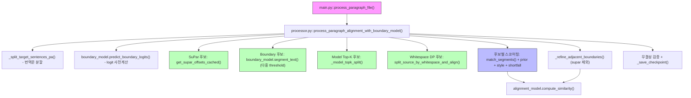
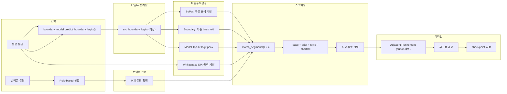

# P2S (Paragraph-to-Sentence Aligner) 코드 해부

> **Abstract**: Detailed code walkthrough of the P2S pipeline implementation. Covers the call hierarchy from `p2s/main.py` through `processor.py` (multi-strategy candidate generation, stage tracing) to `aligner.py` (DP alignment, BGE refinement with token-boundary candidates). Includes Mermaid diagrams for architecture visualization and the boundary model architecture (CharEncoder + MultiHead).

**버전**: 2026-02-10
**목적**: P2S 파이프라인의 함수 로직과 알고리즘을 낱낱이 분석
**현재 F1**: 0.9384 (4934문단 전체, RunPod H200)

---

## 0. 함수 호출 계층도 (Call Hierarchy)



---

## 0.1 알고리즘 흐름도 (Algorithm Flow)



---

## 1. 하이브리드 토크나이저 (Hybrid Tokenizer)

**파일**: `p2s/sentence_splitter.py`, `p2s/processor.py`

P2S는 고전 한문의 특수성과 한국어 정밀 분석을 위해 **Hybrid** 접근법을 사용합니다.

### 1.1 원문(Source): SikuBERT + Kiwipiepy
- **SikuBERT**: 사고전서(四庫全書)로 학습된 모델을 통해 한자 한 글자 단위의 의미를 이해합니다.
- **Kiwipiepy**: 형태소 분석을 통해 한글 현토(하사대, 호되 등)를 인식합니다.
- **결합**: 한자는 SikuBERT 토큰으로, 현토는 Kiwipiepy 형태소로 처리하여 "의미"와 "문법"을 동시에 포착합니다.

### 1.2 번역문(Target): RoBERTa-Hanja + Kiwipiepy
- **RoBERTa-Hanja**: 한자 혼용 현대 한국어에 특화된 인코더입니다.
- **작동**: 먼저 Kiwipiepy로 형태소를 분리한 뒤, 이를 RoBERTa의 서브워드(Subword) 토큰으로 재분할하여 고차원 벡터로 변환합니다.

---

## 2. 파서 및 문장 분할 (Parser & Splitting)

**파일**: `common/new_parsers.py`

### 2.1 SuPar-Kanbun (Dependency Parser)
SuPar는 단순히 마침표를 찾는 것이 아니라, **의존 구문 분석(Dependency Parsing)**을 통해 문장의 주술 관계를 파악합니다.
- **Danku(斷句) 모드**: 구두점이 없는 텍스트에서 문법적 완결성을 기준으로 경계를 예측합니다.
- **Han-Extraction 전략**: 한글 현토가 섞인 경우 `\p{Han}`만 추출하여 SuPar에 전달하고, 반환된 오프셋을 원본 텍스트로 역매핑(Inverse Mapping)합니다.

### 2.2 Stanza (Target Parser)
번역문(한국어)은 Stanza를 통해 문장 경계를 확정합니다.
- **Rule-based 후처리**: Stanza가 분리한 문장 중 "말씀하셨다."와 같이 앞 문장에 붙어야 하는 경우를 정규식으로 감지하여 강제 병합합니다.

---

## 3. BGE-M3 임베더 (Multi-Vector Architecture)

**파일**: `common/embedders/bge.py`

BGE-M3는 세 가지 벡터를 결합하여 **1636차원** 이상의 정보를 활용합니다.

### 3.1 벡터 구성 및 합산 로직
1.  **Dense Score (1024차원)**: 전체 문맥 유사도 (Cosine Similarity)
2.  **Sparse Score (Lexical)**: 키워드 일치 여부 (BM25와 유사한 가중치 합)
3.  **Multi-Vector Score (ColBERT)**: 각 토큰별 최대 유사도의 합 (MaxSim)

### 3.2 유사도 가중치 (Similarity Weights)
실제 코드에서는 다음과 같은 비율(표준값)로 합산됩니다:
```python
final_score = (dense_weight * dense_sim) +
              (sparse_weight * sparse_sim) +
              (colbert_weight * colbert_sim)
```
*현재 그리드 서치를 통해 이 가중치들의 최적 조합을 찾고 있습니다.*

---

## 4. Semantic Boundary Model — 완전 해부

**관련 파일**:
- 모델 정의: `common/semantic_boundary_model.py`
- 추론 로더: `common/semantic_boundary_loader.py`
- 학습 스크립트: `scripts/train_p2s_semantic_boundary.py`
- 데이터 사전계산: `scripts/precompute_semantic_embeddings.py`

이 모델의 임무는 **원문(한문+현토) 문단의 각 문자 위치에 대해 "여기서 문장이 끊기는가?"를 예측**하는 것입니다. 번역문(한국어)의 의미를 참조하여 교차 언어적(Cross-Lingual)으로 판단합니다.

---

### 4.1 아키텍처 개요 (Architecture Overview)

```
클래스: SemanticCrossLingualBoundary (common/semantic_boundary_model.py)

입력 3종:
  src_emb   [B, L_src, 1024]  ← BGE-M3 원문 문자별 임베딩
  tgt_emb   [B, L_tgt, 1024]  ← BGE-M3 번역문 문자별 임베딩
  pos_feat  [B, L_src, 14]    ← kiwipiepy POS 이진 특성

출력:
  logits    [B, L_src]        ← 각 문자의 경계 로짓 (sigmoid 전)
```

#### 4.1.1 파이프라인 다이어그램

```
┌─────────────────────────────────────────────────────────────────┐
│                        FORWARD PASS                             │
│                                                                 │
│  ┌──────────┐   ┌────────┐                                     │
│  │ src_emb  │ + │pos_feat│ = [B, L_src, 1038]                  │
│  │ [1024]   │   │  [14]  │                                     │
│  └────┬─────┘   └────────┘                                     │
│       ▼                                                         │
│  ┌────────────────┐                                             │
│  │  src_proj       │  Linear(1038 → 256)                       │
│  └────────┬───────┘                                             │
│           ▼                                                     │
│  ┌────────────────┐                      ┌──────────┐          │
│  │  BiLSTM         │                     │ tgt_emb  │          │
│  │  (256→128×2)    │                     │ [1024]   │          │
│  └────────┬───────┘                      └────┬─────┘          │
│           ▼                                   ▼                 │
│  ┌────────────────┐                ┌────────────────┐          │
│  │  lstm_proj      │               │  tgt_proj       │          │
│  │  Linear(256→256)│               │  Linear(1024→256)│         │
│  └────────┬───────┘                └────────┬───────┘          │
│           │ lstm_h [B, L_src, 256]          │ tgt_h [B, L_tgt, 256]
│           ▼                                 ▼                   │
│  ┌─────────────────────────────────────────────┐               │
│  │  Cross-Attention (TransformerDecoder ×2)     │               │
│  │  query = lstm_h (원문),  memory = tgt_h (번역문) │            │
│  │  nhead=4, d_model=256, ffn=1024              │               │
│  └───────────────────┬─────────────────────────┘               │
│                      │ cross_out [B, L_src, 256]                │
│                      ▼                                          │
│  ┌─────────────────────────────────────────────┐               │
│  │  Concat: [cross_out ‖ lstm_h] → [B, L_src, 512]            │
│  └───────────────────┬─────────────────────────┘               │
│                      ▼                                          │
│  ┌─────────────────────────────────────────────┐               │
│  │  Classifier                                  │               │
│  │  Linear(512→128) → ReLU → Dropout(0.1)      │               │
│  │  → Linear(128→1) → squeeze                  │               │
│  └───────────────────┬─────────────────────────┘               │
│                      ▼                                          │
│              logits [B, L_src]                                  │
└─────────────────────────────────────────────────────────────────┘
```

---

### 4.2 각 레이어 상세

#### 4.2.1 입력 프로젝션 (Input Projection)

원문의 의미 벡터(1024d)와 문법 신호(14d)를 하나로 합쳐 256차원으로 압축합니다.

```python
# src: [B, L_src, 1024] + [B, L_src, 14] → [B, L_src, 1038]
src_input = torch.cat([src_emb, pos_feat], dim=-1)
src_h = self.src_proj(src_input)  # Linear(1038 → 256)
```

**POS 특성 14차원의 구성** (`common/semantic_boundary_model.py`):
| 인덱스 | 태그 | 분류 | 의미 |
|--------|------|------|------|
| 0-8 | JKS, JKC, JKG, JKO, JKB, JKV, JKQ, JX, JC | 조사 | 주격/보격/관형격/목적격/부사격/호격/인용격/보조사/접속조사 |
| 9-13 | EP, EF, EC, ETN, ETM | 어미 | 선어말/종결/연결/명사형전성/관형형전성 |

**왜 14차원인가?**: 한문 현토에서 조사와 어미의 위치는 문장 경계를 강하게 암시합니다. "니라"(종결어미 EF)가 나오면 그 직후가 문장 끝일 확률이 매우 높습니다. 이 14차원은 BGE-M3가 놓칠 수 있는 한국어 문법 단서를 직접 주입하는 역할입니다.

#### 4.2.2 BiLSTM (순차적 문맥)

```python
self.src_bilstm = nn.LSTM(
    input_size=256,      # proj_dim
    hidden_size=128,     # lstm_hidden
    num_layers=1,
    batch_first=True,
    bidirectional=True,  # 양방향 → 출력 256d
)
self.lstm_proj = nn.Linear(256, 256)  # 2*128 → proj_dim
```

**역할**: 각 문자가 **좌우 문맥 전체**를 흡수하도록 합니다. Attention은 전역적이지만 순서 감각이 약한 반면, LSTM은 "이 문자 바로 앞에 무엇이 있었는가"를 기억합니다. 경계 예측은 본질적으로 순차적 패턴이므로 LSTM이 필수적입니다.

**pack_padded_sequence**: 배치 내 가변 길이를 효율 처리합니다. 패딩된 위치는 LSTM 계산에서 제외됩니다.

#### 4.2.3 Cross-Attention (번역문 참조)

```python
encoder_layer = nn.TransformerDecoderLayer(
    d_model=256,
    nhead=4,             # 4개 헤드 × 64d = 256d
    dim_feedforward=1024,  # 256 × 4
    dropout=0.1,
    batch_first=True,
    norm_first=True,     # Pre-Norm (학습 안정성)
)
self.cross_attn = nn.TransformerDecoder(encoder_layer, num_layers=2)
```

**핵심 구조**: `TransformerDecoder`를 사용하되, 여기서는 **자기주의(self-attention)가 아니라 교차주의(cross-attention)** 목적입니다.
- **query** = `lstm_h` (원문의 각 문자)
- **memory** = `tgt_h` (번역문의 각 문자)

**작동 원리**: 원문의 각 문자가 "번역문의 어디와 의미적으로 대응하는가?"를 어텐션 가중치로 계산합니다. 문장 경계 근처에서는 번역문의 대응 범위가 전환되므로, 어텐션 패턴이 급변하는 지점이 곧 경계 후보입니다.

**왜 2레이어인가?**: 1레이어는 단순 대응만 학습하지만, 2레이어는 첫 레이어의 대응 정보를 바탕으로 "경계 패턴"까지 학습할 수 있습니다.

#### 4.2.4 분류기 (Boundary Classifier)

```python
self.classifier = nn.Sequential(
    nn.Linear(512, 128),   # [cross_out ‖ lstm_h] → 128
    nn.ReLU(),
    nn.Dropout(0.1),
    nn.Linear(128, 1),     # → 스칼라 logit
)
```

**설계 의도**: Cross-attention 출력(번역문 참조 결과)과 BiLSTM 출력(순차적 문맥)을 **concat**하여 최종 판단에 사용합니다. 두 정보원이 합의(agree)하면 강한 양의 logit, 불일치하면 약하거나 음의 logit이 출력됩니다.

---

### 4.3 학습 데이터 준비 (Data Pipeline)

**파일**: `scripts/precompute_semantic_embeddings.py`

학습 데이터는 3단계를 거쳐 준비됩니다. BGE-M3 인코딩이 가장 비싸므로, **사전계산(precompute) + 파일 저장** 전략을 사용하여 학습 시에는 BGE-M3 로드 없이 텐서만 읽습니다.

#### 4.3.1 입력 데이터

```
datasets/splits/paragraph_train.xlsx  → 문단 단위 (책명, 문단식별자, 원문, 번역문)
datasets/splits/sentence_train.xlsx   → 문장 단위 (책명, 문단식별자, 문장식별자, 원문, 번역문)
```

#### 4.3.2 경계 라벨 생성

```python
def build_sentence_boundary_labels(paragraph_src, sentence_srcs):
    """
    문단 원문에서 각 문장의 마지막 문자 위치에 1을 표시.
    마지막 문장은 경계가 아니므로 0.

    예: 문단 = "天下太平也百姓安樂也"
        문장1 = "天下太平也"  문장2 = "百姓安樂也"
        라벨 = [0,0,0,0,1,0,0,0,0,0]
                        ↑ 문장1 끝 = 경계
    """
```

**핵심**: 문장 경계의 정의는 "이 문자 다음에서 분할한다"입니다. 마지막 문장 끝은 문단 끝이므로 경계로 표시하지 않습니다.

**클래스 불균형**: 문단 평균 50-100자, 문장 2-5개 → 경계는 전체의 **~2-3%**에 불과합니다. 97%가 비경계(0)입니다.

#### 4.3.3 POS 특성 추출

```python
def extract_pos_features_detailed(text, kiwi_tok):
    """
    kiwipiepy.pos()로 각 문자의 형태소 태그를 14차원 이진 벡터로 변환.

    예: "天下太平하니라" 에서
        '하' → EC(연결어미) 인덱스 활성화
        '니' → EF(종결어미) 인덱스 활성화
        '라' → EF(종결어미) 인덱스 활성화
    """
```

#### 4.3.4 BGE-M3 문자별 임베딩

```
원문 텍스트 → BGE-M3 토크나이저 → 서브워드 토큰 → XLM-RoBERTa hidden state [L_tok, 1024]
                                                            ↓
                                              token_emb_to_char_emb()
                                                            ↓
                                              문자별 임베딩 [L_char, 1024]
```

**token → char 변환**: 한 토큰이 여러 문자를 커버하면 해당 문자 전부에 같은 임베딩을 복사합니다. 어떤 토큰에도 속하지 않는 문자(예: 특수문자)는 zero 벡터입니다.

#### 4.3.5 최종 저장 형식

```python
# datasets/precomputed/semantic_boundary/precomputed_all.pt
sample = {
    "src_emb":  [L_src, 1024],  # fp16
    "tgt_emb":  [L_tgt, 1024],  # fp16
    "pos_feat": [L_src, 14],    # fp16
    "labels":   [L_src],        # fp16 (0 or 1)
    "book":     str,            # 책명 (split 기준)
    "para_id":  float,          # 문단식별자
}
```

**청크 처리**: GPU 메모리 제약으로 500문단씩 나누어 임베딩을 추출하고, 청크별로 저장한 뒤 최종 병합합니다. 중단 시 이어서 진행 가능합니다.

---

### 4.4 손실 함수 (Loss Functions)

**파일**: `common/semantic_boundary_model.py`

~2-3%의 경계 비율에 대응하기 위해 두 가지 손실 함수를 제공합니다.

#### 4.4.1 DiceBCELoss (기본)

```python
loss = (1 - dice_weight) × BCE + dice_weight × Dice
```

| 구성 요소 | 역할 |
|-----------|------|
| **BCE** (Binary Cross-Entropy) | 각 위치별 이진 분류. `pos_weight`로 경계에 가중치 부여 |
| **Dice Loss** | 집합 유사도 기반. TP를 극대화하는 방향으로 학습 (F1과 직접 연관) |

**Dice Loss 공식**:
```
Dice = 1 - (2 × |pred ∩ gold| + smooth) / (|pred| + |gold| + smooth)
```

smooth=1.0으로 분모가 0이 되는 것을 방지합니다.

#### 4.4.2 FocalBoundaryLoss (선택)

```python
focal_loss = (1 - p_t)^γ × BCE × position_weight
```

| 파라미터 | 기본값 | 역할 |
|----------|--------|------|
| `gamma` | 2.0 | Focal 지수. 쉬운 negative(확실한 비경계)의 기여를 억제 |
| `pos_weight` | 10.0 | 경계 위치(label=1)에 10배 가중치 |
| `near_weight` | 5.0 | 경계 좌우 ±1칸에 5배 가중치 |
| `dice_weight` | 0.3 | 보조 Dice 손실 비율 |

**near_weight의 의미**: 경계에서 1칸 벗어난 위치도 "거의 경계"이므로 이 위치의 오분류도 중하게 처벌합니다. 경계 판단의 정밀도를 높이는 효과입니다.

---

### 4.5 학습 절차 (Training Procedure)

**파일**: `scripts/train_p2s_semantic_boundary.py`

#### 4.5.1 하이퍼파라미터

| 항목 | 값 | 비고 |
|------|-----|------|
| epochs | 30 | 최대 (early stopping 적용) |
| batch_size | 32 | 가변 길이 → collate_fn 패딩 |
| optimizer | AdamW | lr=1e-3, weight_decay=0.01 |
| scheduler | CosineAnnealingLR | T_max=30, eta_min=1e-6 |
| grad_clip | 1.0 | `clip_grad_norm_` |
| patience | 7 | val F1 개선 없으면 조기 종료 |

#### 4.5.2 Train/Val 분할

```python
split_by_book(samples, val_ratio=0.2, seed=42)
# 책명 기준으로 분리 → 같은 책이 train과 val에 동시에 포함되지 않음
# → 모델이 특정 책의 문체를 암기하는 것을 방지
```

#### 4.5.3 학습 루프 (에포크당)

```
1. Forward: logits = model(src_emb, tgt_emb, pos_feat, src_mask, tgt_mask)
2. Loss:    loss = criterion(logits, labels, valid_mask)
3. Backward: loss.backward()
4. Clip:    clip_grad_norm_(params, 1.0)
5. Step:    optimizer.step()
6. Validate: threshold grid search [-2.0, -1.5, ..., 3.0]
7. Save:    val_f1 개선 시 best checkpoint 저장
```

#### 4.5.4 Threshold Grid Search

검증 시 logit 공간에서 11개 threshold를 테스트하여 최적 F1을 달성하는 값을 선택합니다:

```python
thresholds = [-2.0, -1.5, -1.0, -0.5, 0.0, 0.5, 1.0, 1.5, 2.0, 2.5, 3.0]
# 각 threshold에서 전체 검증 데이터의 P/R/F1 계산 → best 선택
# 이 best_threshold가 체크포인트에 저장됨
```

#### 4.5.5 체크포인트 구조

```python
checkpoint = {
    "state_dict":      model.state_dict(),
    "encoder_model":   "BAAI/bge-m3",
    "max_len":         512,
    "model_type":      "semantic_crosslingual",
    "tasks":           ["pa"],
    "proj_dim":        256,
    "n_attn_layers":   2,
    "n_attn_heads":    4,
    "dropout":         0.1,
    "lstm_hidden":     128,
    "best_threshold":  float,  # logit 공간
    "best_val_f1":     float,
    "epoch":           int,
}
```

---

### 4.6 추론 흐름 (Inference Pipeline)

**파일**: `common/semantic_boundary_loader.py`

#### 4.6.1 로더 초기화

```python
class SemanticBoundaryLoader:
    def __init__(self, model_path, device="cuda"):
        # 1. 체크포인트에서 하이퍼파라미터 복원
        # 2. 모델 재구성 + state_dict 로드 + eval() 모드
        # 3. Lazy loading: BGE-M3, tokenizer, kiwipiepy는 첫 사용 시 로드
```

#### 4.6.2 핵심 추론 메서드

**`predict_boundary_logits_with_target(src_text, tgt_text)`**:
```
원문 + 번역문 → 정규화(공백 제거)
  → BGE-M3로 각각 문자별 임베딩 추출
  → kiwipiepy로 POS 특성 추출
  → 모델 forward → logits [L_src]
```

**`segment_with_target(src_text, tgt_text, threshold, ...)`**:
```
1. Logit 예측 (또는 사전계산값 재사용)
2. Sigmoid → 확률 변환
3. Threshold 적용 → 후보 위치 추출
4. 인접 그루핑 → peak 선택 (연속된 높은 logit 중 최댓값만)
5. 최소 길이 필터링 (기본 6자)
6. 어절 경계 스냅 (_snap_peaks_to_eojeol)
7. 정규화 좌표 → 원본 좌표 역매핑
8. 세그먼트 리스트 반환
```

#### 4.6.3 어절 보호 (Eojeol Snapping)

```python
def _snap_peaks_to_eojeol(raw_text, peaks):
    """
    경계 위치를 가장 가까운 어절 끝으로 이동.
    한문 현토에서 어절 내부가 잘리면 의미가 파괴되므로
    반드시 공백 경계에서만 분할합니다.
    """
```

---

### 4.7 P2S 프로세서에서의 사용

**파일**: `p2s/processor.py`

#### 4.7.1 로짓 가공 (Logit Engineering)

프로세서에서 경계 모델의 raw logit은 직접 사용되지 않고, **가공**을 거쳐 DP 비용함수에 주입됩니다:

```python
bonus = 0.020 * max(0.0, tanh(logit / 3.0))
```

| logit 값 | tanh(logit/3) | 보너스 |
|-----------|---------------|--------|
| -3.0 | -0.76 | **0.000** (음수 → 0 클램핑) |
| 0.0 | 0.00 | 0.000 |
| 1.5 | 0.46 | 0.009 |
| 3.0 | 0.76 | 0.015 |
| 6.0 | 0.96 | 0.019 |
| 9.0 | 1.00 | **0.020** (최대) |

**설계 의도**: 모델이 "경계가 아니다"라고 판단한 위치(음수 logit)에는 패널티를 주지 않습니다. 모델 오판이 DP를 왜곡하는 것을 방지하기 위해, **양의 확신이 있을 때만** 보너스를 부여합니다.

#### 4.7.2 SuPar Bonus Injection

```python
if pos in supar_offsets_norm:
    bonus += 0.20  # SuPar 구문 분석 경계와 일치 시
```

SuPar의 고전 문법 지식을 DP의 비용 함수에 강력한 **가이드라인**으로 주입합니다. 경계 모델 보너스(최대 0.02)보다 10배 강한 신호입니다.

#### 4.7.3 사용 패턴

1. **logit 사전계산**: 문단당 1회 호출, 캐싱하여 다중 threshold 디코딩 및 model_topk에서 재사용
2. **다중 threshold 후보**: `segment_text(threshold=0.3)`, `segment_text(threshold=0.5)` 등 여러 threshold로 후보군 생성
3. **model_topk 후보**: logit 상위 K개 위치를 직접 후보로 사용
4. **번역문 분할 폴백**: rule-based 분할 실패 시 boundary 모델로 번역문도 분할 가능

---

## 5. 후보 스코어링 및 선택

**파일**: `p2s/processor.py` (함수 `process_paragraph_alignment_with_boundary_model`, ~line 1690-2135)

### 5.1 후보별 평가 (~line 1836)
각 candidate_set에 대해 `alignment_model.match_segments(cand, tgt_sentences)`로 alignment score를 계산합니다.
- Dual Encoder Alignment Model (`common/boundary_aware_alignment_loader.py`)이 (src, tgt) 쌍의 유사도를 반환
- `_avg_sim()` 으로 평균 유사도 계산 → `score` 초기값

### 5.2 보정 항목 (코드 순서대로, ~line 1840-2018)

```python
score = avg_similarity                           # base (line 1838)
score -= 0.05 * shortfall                        # desired 미달 패널티 (line 1843)
score += prior_bonus                             # 후보 유형별 사전 보너스 (line 1856)
# → boundary 후보가 continuation > terminal이면 prior 제거 (line 1870)
score += style_bonus                             # 종결/연결 어미 보너스 (line 1877)
# → avg_sim < 0.6이고 whitespace_dp가 아니면 style_bonus = 0 (line 1876)
score -= per_pair_penalty * short_pairs           # 긴 tgt↔짧은 src 쌍 패널티 (line 1900)
score -= penalty_empty_src if empty_src > 0       # 빈 원문 세그먼트 패널티 (line 2018)
# whitespace_dp 전용 추가 패널티:
score -= penalty_short * ws_severe_pairs          # 과분할 패널티 (line 1933)
score -= penalty_very_short * ws_very_short_pairs # 극단 과분할 패널티 (line 1935)
```

### 5.3 최고 후보 선택 (~line 2064)
- `score > best_score`인 후보를 best로 갱신
- 모든 후보 실패 시 `safe_source_split()` 폴백 (line 2096)

### 5.4 Adjacent Refinement (~line 2265)
**내부 함수**: `_refine_adjacent_boundaries()` (~line 454)

- **적용 대상**: `boundary(...)` 또는 `model_topk(...)` 태그만 (line 2271)
- **supar 제외**: 구문 분석 경계는 이미 정확하므로 교정하면 오히려 악화 (line 2266 주석)
- **알고리즘**: 각 내부 경계를 ±`max_shift_tokens` 이동, alignment score 개선 시 채택
- **Quality Guard**: 교정 후 총 유사도가 악화되면 롤백 (line 2311: `score_after < score_before`)

### 5.5 BGE Refinement (3-pass, 활성)

**내부 함수**: `_bge_refine_boundaries()` (~line 1443)

Adjacent Refinement 후, BGE-M3 유사도 기반으로 경계를 미세 조정합니다. **모든 후보 전략**(supar/boundary/whitespace_dp/model_topk)에 적용됩니다.

```python
for _bge_pass in range(3):  # 3-pass: 순차 의존성 해소
    src_sentences = _bge_refine_boundaries(
        src_sentences, tgt_sentences, max_shift_chars=40
    )
```

#### 핵심 메커니즘

1. **토큰 경계만 후보** (`_token_boundary_positions()`): 문자 단위가 아닌 **어절(공백) 경계**에서만 이동 후보를 생성하여 S/N 대폭 개선
2. **스코어링 3요소**:
   ```python
   score = sim_left + sim_right                              # BGE-M3 유사도
         + _hyeonto_ending_bonus(combined, pos)              # 현토 종결어미 +0.06
         + _length_balance_bonus(pos, total_src, tgt_l, tgt_r)  # 길이비율 보너스
   ```
3. **현토 종결어미 보너스** (+0.06): `니라`, `리라`, `리오`, `로다`, `도다` 등 — 한문 현토에서 문장 끝 패턴
4. **길이 비율 보너스** (`_length_balance_bonus`): src 분할 비율과 tgt 분할 비율의 차이에 -0.06을 곱함 → 비율이 일치할수록 보너스, 불일치할수록 패널티
5. **min_improvement = 0**: 미세한 개선도 수용 (길이비율 보너스가 노이즈 방지 역할)
6. **3-pass**: 인접 경계 간 순차 의존성을 해소하기 위해 3회 반복

#### 이 기법이 F1 0.89→0.93으로 끌어올린 결정적 요인
BGE-M3 유사도만으로는 3-6자 경계 이동의 차이를 감지하지 못합니다 (유사도 변화 ~0.01 수준). **길이 비율**이 결정적 보조 시그널로 작용합니다: 원문을 40:60으로 나눴는데 번역문이 50:50이라면, 원문 분할점을 50:50 방향으로 이동시키는 것이 올바를 가능성이 높습니다.

---

## 6. 무결성 검증 (Integrity Validation)

**파일**: `p2s/processor.py` (리파인 종료 시점)

정렬이 완료된 후, 시스템은 다음과 같은 엄격한 검증을 수행합니다.

### 6.1 텍스트 보존 검증 (Text Invariance)
- **로직**: `original_src == "".join(predicted_src_segments)`
- **검사**: 단 한 글자라도 누락되거나 중복되었는지 체크합니다. 공백을 제외한 모든 유니코드 문자가 일치해야 합니다.

### 6.2 정렬 개수 검증 (Count Match)
- **로직**: `len(src_segments) == len(tgt_sentences)`
- **검사**: 번역문 문장 수와 강제로 맞춘 원문 세그먼트 수가 일치하는지 확인합니다.

### 6.3 Do-No-Harm 게이트
- **로직**: `DP_Score > Greedy_Score + Gain_Threshold`
- **검사**: DP가 제안한 새로운 분할이 기존(Greedy) 방식보다 임상적으로 유의미한 점수 향상이 있을 때만 최종 결과로 채택합니다.

---

## 7. 캐시 레이어 해부 (Cache Anatomy)

성능의 핵심은 **다중 캐시**에 있습니다.

1.  **Parser Cache**: SuPar/Stanza 결과를 담은 JSON (텍스트 변경 전까지 불변)
2.  **BGE Precomputed Embeddings**: `process_paragraph_file()` 시작 시 전체 원문/번역문을 사전 인코딩하여 메모리에 보관. 개별 후보 평가 시 재계산 없이 조회
3.  **Boundary Logit Cache**: `predict_boundary_logits()`를 문단당 1회 호출, 결과를 `src_boundary_logits`에 저장. 다중 threshold 디코딩 및 model_topk에서 재사용
4.  **Sim Cache**: (원문, 번역문) 쌍의 alignment 유사도 점수 저장
5.  **Checkpoint**: `_save_checkpoint()`가 매 N문단마다 중간 결과를 CSV로 저장. 재실행 시 자동 resume

---

## 8. 전체 워크플로우 요약 (Flowchart)

1.  **Load**: 데이터 및 모델 로드 (Boundary Model, Alignment Model, BGE-M3, SuPar 등)
2.  **Resume Check**: checkpoint 파일이 있으면 처리 완료된 문단을 건너뜀
3.  **BGE Precompute**: 전체 원문/번역문 임베딩을 사전 계산 (GPU 배치)
4.  **Logit Precompute**: 원문별 `predict_boundary_logits()` 1회 호출, 캐싱
5.  **Tgt Split**: 번역문을 rule-based로 분할 → M개 확정
6.  **Multi-Candidate**: SuPar, Boundary(다중 threshold), Model Top-K, Whitespace DP로 원문 후보 4종 생성
7.  **Score & Select**: 각 후보에 match_segments() + prior + style + shortfall → 최고 후보 선택
8.  **Refine**: Adjacent refinement (boundary/model_topk만, supar 제외) + quality guard
9.  **Verify**: 텍스트 무결성 및 개수 일치 확인
10. **Checkpoint**: 매 N문단마다 CSV 저장
11. **Output**: XLSX 저장 및 성능(F1) 평가
