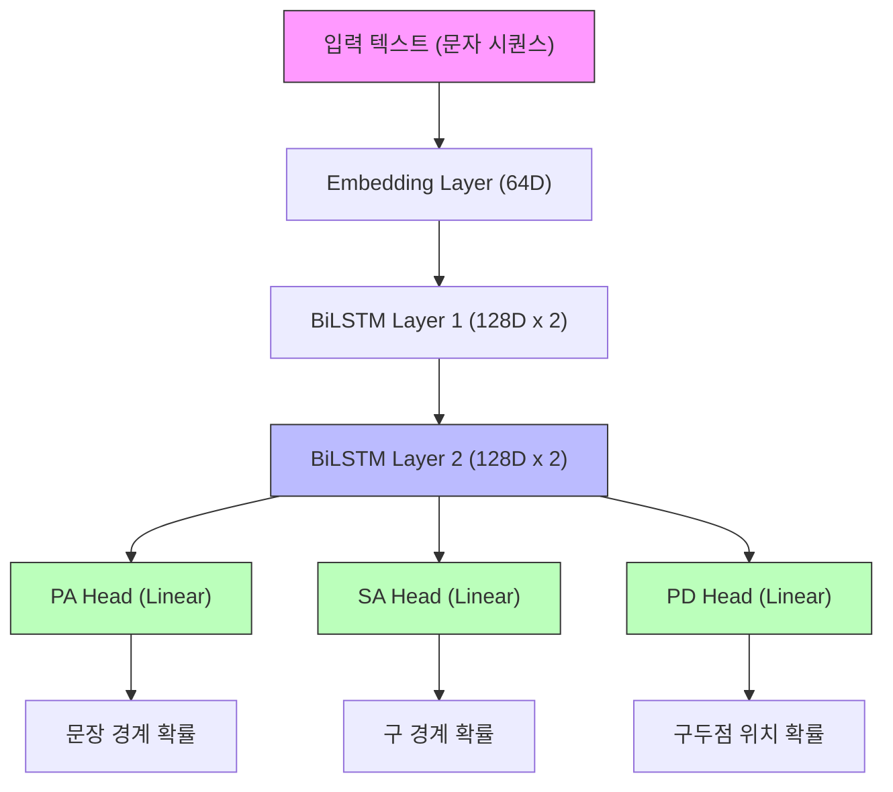

# P2S (Paragraph-to-Sentence Aligner) 메커니즘 상세 설명

> **Abstract**: The P2S (Paragraph to Sentence) pipeline splits paragraph-level Classical Chinese-Korean parallel text into sentence-level aligned pairs. It uses a target-anchored approach: Korean translation sentence boundaries serve as anchors, and Classical Chinese source boundaries are optimized using multi-strategy candidate generation (SuPar parsing, boundary model, whitespace DP, TopK) followed by 3-pass BGE refinement with length-ratio bonus. Achieves F1 = 0.9384 on 4,934 paragraphs.

**버전**: 2026-02-10
**목적**: 고전 한문(원문)과 현대 한국어(번역문) 간의 문장 단위 정렬
**약칭**: P2S (구: PA)
**현재 F1**: 0.9384 (4,934문단 전체, RunPod H200 SXM)

---

## 1. 개요

PA(Paragraph Aligner)는 **문단 단위**로 입력된 원문-번역문 쌍을 **문장 단위**로 분할하고 정렬하는 시스템입니다.

### 1.1 입력과 출력

| 구분 | 형식 | 예시 |
|------|------|------|
| **입력** | 문단 단위 (원문, 번역문) | ("子曰學而時習之不亦說乎", "선생님께서 말씀하셨다. 배우고 때때로 익히면 기쁘지 아니한가.") |
| **출력** | 문장 단위 정렬 쌍 | [("子曰", "선생님께서 말씀하셨다."), ("學而時習之不亦說乎", "배우고 때때로 익히면 기쁘지 아니한가.")] |

### 1.2 핵심 과제

고전 한문과 현대 한국어는 언어 구조가 완전히 다릅니다:
- **한문**: 공백/구두점 없이 연속된 한자
- **한국어**: 어절 단위로 공백 구분, 구두점으로 문장 경계 명확

따라서 단순 규칙 기반 분할이 불가능하며, **의미적 유사도**를 기반으로 정렬해야 합니다.

### 1.3 핵심 전략: 번역문 기준 정렬

**P2S의 핵심 전략**은 번역문(한국어)의 **의미적 문장 단위** 경계를 먼저 확정하고, 원문(한문)의 경계를 그에 맞춰 **조정**하는 것입니다.

```
번역문: [의미단위1] [의미단위2] [의미단위3]  ← 확정 (규칙 기반 분할)
             ↓          ↓          ↓
원문:      [???]  +   [???]  +   [???]     ← 조정 (유사도 최대화)
```

#### 번역문의 "의미적 문장 단위" 결정

번역문(한국어) 분할은 단순 구두점이 아닌 **의미 기반 규칙**을 적용합니다:

| 규칙 | 예시 | 설명 |
|------|------|------|
| **발화자-발화내용 통합** | "공자께서 말씀하셨다. 배우고..." → [**통합**] | `"공자께서 말씀하셨다."`를 분리하지 않고 뒤따르는 발화 내용(`"배우고..."`)과 하나로 묶습니다. |
| **인용 종결부 통합** | "...라고 하였다." → [**통합**] | 인용부호 뒤의 종결부(`"~라고 하였다"`)를 앞의 인용 내용과 분리하지 않고 하나의 세그먼트로 보존합니다. |
| **종결어미 인식** | "-다", "-까", "-라" | 문장 종결 패턴 인식 |
| **복합문 처리** | "...하니, ...하도다." | 의미적으로 연결된 절은 통합 |

**이유**:
1. **번역문은 경계가 상대적으로 명확**: 종결어미, 구두점, 인용부호 활용
2. **원문은 경계가 모호**: 한자가 연속되어 규칙 기반 분할 불가
3. **번역문 문장 수 = 원문 문장 수**: 1:1 매칭 가정

**따라서**: 번역문의 M개 의미 단위에 맞춰 원문을 M개 세그먼트로 분할하는 **최적 경계 위치**를 찾는 문제로 정의됩니다.

---

## 2. 파이프라인 구조

P2S는 크게 6단계로 구성됩니다:

```
[입력 문단]
    ↓
[1단계] 번역문 문장 분할 (rule-based, 개수 M 확정)
    ↓
[2단계] 원문 경계 후보 다중 생성
         ├─ SuPar (구문 분석 기반)
         ├─ Boundary Model (다중 threshold)
         ├─ Model Top-K (logit peak 기반)
         └─ Whitespace DP (공백 기반 의미 정렬)
    ↓
[3단계] 후보별 alignment score + prior + style bonus → 최고 후보 선택
    ↓
[4단계] Adjacent Refinement (boundary/model_topk만, supar 제외)
    ↓
[5단계] 무결성 검증 + 체크포인트 저장
    ↓
[출력 정렬 쌍]
```

---

## 3. 1단계: 번역문 문장 분할

### 3.1 번역문(한국어) 분할: Rule-based (`_split_target_sentences_pa`)

번역문 분할은 **rule-based 전용**입니다 (boundary 모델 사용 금지). 개수 M이 확정되면 원문은 M개로 분할해야 합니다.

**작동 원리**:
1. Stanza로 기초 문장 경계 감지
2. 발화자-발화내용 통합, 인용 종결부 통합 등 의미 기반 후처리
3. `max_length` 초과 시 추가 분할

**예시**:
```
입력: "선생님께서 말씀하셨다. 배우고 때때로 익히면 기쁘지 아니한가."
출력: ["선생님께서 말씀하셨다.", "배우고 때때로 익히면 기쁘지 아니한가."]
→ M = 2 확정
```

### 3.2 원문(한문) 분할

원문은 1단계에서 분할하지 않습니다. 2단계에서 다중 후보 방식으로 생성됩니다.

SuPar-Kanbun은 **후보 생성기 중 하나**로 사용됩니다:
- 한자만 추출(`\p{Han}`) → SuPar 실행 → 오프셋 역매핑
- 결과는 `supar(N)` 태그로 candidate_sets에 추가

---

## 4. 2단계: 원문 경계 후보 다중 생성

각 후보 방식이 독립적으로 원문 분할안을 생성하며, 3단계에서 최고 후보를 선택합니다.

### 4.1 경계 후보 소스 (4종)

| 소스 | 태그 | 설명 | 특징 |
|------|------|------|------|
| **SuPar** | `supar(N)` | 고전 한문 의존 구문 분석 | 문법 기반, 정확하지만 개수 불일치 가능 |
| **Boundary Model** | `boundary(th=X,N)` | 신경망 경계 예측, threshold를 낮춰가며 시도 | 다중 threshold (0.72→0.62→0.52→0.42) |
| **Model Top-K** | `model_topk(N)` | Logit 상위 (M-1)개 peak를 경계로 직접 사용 | 정확히 desired 개수 보장 |
| **Whitespace DP** | `whitespace_dp(N)` | 공백 기반 의미 정렬 DP | 어절 내부 분할 원천 차단 |

### 4.2 Boundary Model

별도 학습된 신경망(BiLSTM + CrossAttention)이 각 문자 위치의 경계 확률을 예측합니다.

**작동**:
1. 정규화된 원문(`_norm_for_boundary`: 공백/개행/탭 제거)에 대해 logit 한 번 계산
2. 이 logit을 여러 threshold에서 재사용 (사전 계산 캐싱)
3. threshold를 순차 하강하며 desired 개수 이상 세그먼트를 생성하는 최초 결과 채택

### 4.3 Model Top-K

Boundary Model의 logit 중 상위 (desired-1)개 peak를 직접 경계로 사용합니다.
- threshold 방식과 달리 **정확히 desired 개수 보장**
- 모델 확신도 기반으로 가장 확실한 경계만 선택

---

## 5. 3단계: 유사도 기반 매칭

### 5.1 임베딩 (Embedding)

텍스트를 고차원 벡터로 변환합니다.

**사용 모델**: BGE-M3 (Multilingual, Multi-Functionality, Multi-Granularity)

#### 5.1.1 Multi-Vector 임베딩

BGE-M3는 **Multi-Vector** 방식을 사용하여 텍스트의 다양한 측면을 포착합니다:

| 벡터 유형 | 차원 | 설명 |
|----------|------|------|
| **Dense Vector** | 1024 | 전체 의미를 압축한 단일 벡터 |
| **Sparse Vector** | 가변 | 중요 토큰의 가중치 (BM25 유사) |
| **ColBERT Vector** | 1024 × N | 각 토큰별 벡터 (Late Interaction) |

#### 5.1.2 유사도 계산 (총 1636차원 활용)

실제 유사도 점수는 여러 벡터의 조합으로 계산됩니다:

```
최종_유사도 = α × dense_sim + β × sparse_sim + γ × colbert_sim
```

| 구성 요소 | 계산 방법 | 역할 |
|----------|----------|------|
| Dense Similarity | 코사인 유사도 (1024차원) | 전체 의미 비교 |
| Sparse Similarity | 토큰 가중치 내적 | 키워드 매칭 |
| ColBERT Similarity | MaxSim (토큰별 최대 유사도 합) | 부분 매칭 |

**각 차원의 역할**:
- **Dense (1024)**: "이 문장이 전체적으로 무슨 뜻인가?"
- **Sparse (~100)**: "핵심 단어가 일치하는가?"
- **ColBERT (1024×N)**: "세부 표현이 얼마나 대응하는가?"

#### 5.1.3 코사인 유사도

```
similarity = (벡터A · 벡터B) / (||벡터A|| × ||벡터B||)
```
- 1에 가까울수록 의미가 유사
- 0에 가까울수록 관련 없음
- -1에 가까울수록 반대 의미

### 5.2 후보별 스코어링 및 최고 후보 선택

각 후보 세트에 대해 `match_segments()`로 alignment 유사도를 계산하고, 보정 항목을 더해 최고 후보를 선택합니다.

**점수 구성** (코드 순서):
```
score  = avg_similarity                     # Alignment Model 평균 유사도
score -= 0.05 × shortfall                   # desired 미달 패널티
score += prior_bonus                        # 후보 유형별 사전 보너스
       (boundary 후보가 연결형>종결형이면 prior 제거)
score += style_bonus                        # 종결/연결 어미 보너스
       (avg_sim<0.6이면 무시, whitespace_dp는 항상 적용)
score -= per_pair_penalty × short_pairs     # 긴 tgt↔짧은 src 쌍 패널티
score -= penalty_empty_src                  # 빈 원문 세그먼트 패널티 (0.5)
       + whitespace_dp 전용 추가 패널티들
```

| 요소 | 값/기준 | 설명 |
|------|---------|------|
| **base_score** | alignment sim 평균 | Dual Encoder Alignment Model |
| **shortfall_penalty** | 0.05/개 | desired 미달 시 match_segments 내부 분할 의존 감소 |
| **prior_bonus** | supar: 0.42, boundary: 0.40 | 동점 제거 + 자연 경계 선호 |
| **style_bonus** | 종결형 +, 연결형 - | "니라", "도다" 등 한문 현토 종결 패턴 |
| **short_pair_penalty** | 0.015/쌍 | tgt≥40자인데 src≤12자인 쌍 |
| **empty_src_penalty** | 0.5 | 빈 원문 세그먼트 존재 시 |

---

## 6. 4단계: Adjacent Refinement (인접 경계 미세 조정)

### 6.1 목적

3단계에서 선택된 최고 후보의 경계를 인접 위치로 이동시켜 alignment score를 개선합니다.

### 6.2 적용 조건

| 후보 유형 | Refinement 적용 |
|----------|----------------|
| `boundary(...)` | O |
| `model_topk(...)` | O |
| `supar(...)` | **X** (supar 경계는 refinement 제외) |
| `whitespace_dp(...)` | O |

**supar 제외 이유**: SuPar가 gold와 완벽 일치하는 경계를 생성해도, DP 기반 adjacent refinement이 alignment model 점수 최적화 과정에서 경계를 이동시켜 결과를 악화시킴. (F1 0.82 → 0.9048 달성의 핵심 변경)

### 6.3 알고리즘

각 내부 경계에 대해 좌우 `max_shift_tokens`만큼 이동을 시도하고, alignment score가 개선되면 채택합니다.

```
for 각 경계 i in [1, M-1]:
    현재_score = alignment_score(현재_분할)
    for shift in [-max_shift, ..., +max_shift]:
        새_분할 = 경계[i]를 shift만큼 이동
        새_score = alignment_score(새_분할) - shift_penalty * |shift|
        if 새_score > 현재_score:
            경계[i] = 새 위치
```

### 6.4 BGE Refinement (3-pass, 활성)

BGE-M3 문자 수준 유사도 기반 경계 미세 조정. **v3에서 재활성화**되어 F1 향상의 핵심 역할.

**핵심 메커니즘**:
1. **토큰 경계만 후보** (`_token_boundary_positions()`): 문자 단위 대신 어절 경계만 탐색 → S/N 대폭 개선
2. **현토 종결 어미 보너스** (+0.06): `니라`, `리라`, `리오` 등 한문 현토 종결 패턴
3. **길이 비율 보너스** (`_length_balance_bonus`): src/tgt 분할 비율 일치 여부로 3~6자 미세 이동 감지
4. **3-pass refinement**: 순차 의존성 해소 (경계 i의 이동이 경계 i+1에 영향)
5. **min_improvement = 0**: 미세한 개선도 수용 (길이비율 보너스가 노이즈 방지)
6. **max_shift_chars = 40**: 넓은 탐색 범위

**교훈**: BGE 유사도만으로는 3~6자 이동을 감지 못함 → 길이 비율이 결정적 보조 시그널

---

## 7. 성능 최적화

### 7.1 캐싱 전략

| 캐시 종류 | 대상 | 효과 |
|-----------|------|------|
| **BGE 캐시** | 텍스트 → 임베딩 벡터 | GPU 재계산 방지 |
| **Parser 캐시** | 텍스트 → 분할 결과 | 파싱 재실행 방지 |
| **Sim 캐시** | (원문, 번역문) → 유사도 | 반복 계산 방지 |

### 7.2 Numba JIT 컴파일

DP 알고리즘의 핵심 루프를 **Numba**로 컴파일하여 C 수준의 속도를 달성합니다.

**적용 전**: Python 루프 → 느림
**적용 후**: 기계어 컴파일 → 10~50배 빠름

### 7.3 GPU 배치 처리

유사도 계산을 개별 호출 대신 **배치(Batch)**로 묶어 GPU에 전송합니다.

```
개별 처리: GPU 호출 1000회 → 오버헤드 큼
배치 처리: GPU 호출 10회 (100개씩) → 오버헤드 작음
```

---

## 8. 파라미터 설명

### 8.1 주요 파라미터

| 파라미터 | 현재 값 | 설명 |
|----------|---------|------|
| `boundary_threshold` | 0.72 | 경계 모델 기본 threshold (다중 threshold 하강: 0.72→0.62→0.52→0.42) |
| `candidate_prior_bonus_by_prefix` | supar: 0.42, boundary: 0.40 | 후보 유형별 사전 보너스 (동점 제거) |
| `shortfall_penalty` | 0.05/개 | desired 미달 후보에 대한 감점 |
| `shift_penalty_factor` | 0.0008 | Adjacent refinement 시 이동 거리 페널티 |
| `adjacent_refine_max_shift_tokens` | 1 | 경계 이동 최대 토큰 수 |

### 8.2 최적화 히스토리

| 변경 사항 | F1 변화 | 측정 기준 |
|----------|---------|----------|
| 정규화 버그 수정 (공백/개행/탭 제거 통일) | 0.69 → 0.82 | 10문단 gold |
| Adjacent refinement에서 supar 제외 | 0.82 → 0.86+ | 10문단 gold |
| Shortfall penalty 추가 | 0.86+ → 0.88+ | 10문단 gold |
| Prior 차별화 (supar > boundary) | 0.88+ → 0.9048 | 10문단 gold |
| **v1**: BGE refinement 재활성화 | 0.6684 → 0.7977 | 100문단 test |
| **v2**: min_improvement↓ + 2-pass | 0.7977 → 0.8937 | 100문단 test |
| **v3**: 길이비율 보너스 + 3-pass + min_imp=0 | 0.8937 → 0.9273 | 100문단 test |
| **전체 테스트** (RunPod H200) | → **0.9384** | **4,934문단 전체** |

---

## 9. 평가 지표

### 9.1 Micro F1 Score

**정밀도 (Precision)**:
```
Precision = 올바르게 예측한 경계 수 / 전체 예측 경계 수
```

**재현율 (Recall)**:
```
Recall = 올바르게 예측한 경계 수 / 전체 정답 경계 수
```

**F1 Score**:
```
F1 = 2 × (Precision × Recall) / (Precision + Recall)
```

### 9.2 Target-Exact 매칭

번역문 문장이 **정확히 일치**하는지 확인합니다.
- 예측: "선생님께서 말씀하셨다."
- 정답: "선생님께서 말씀하셨다."
- 결과: ✅ 일치 (TP)

---

## 10. 제한 사항 및 향후 과제

### 10.1 현재 제한

1. **1:1 매칭 가정**: 원문 1문장 = 번역문 1문장
   - 실제로는 1:2, 2:1 매칭도 존재

2. **문맥 무시**: 각 문단을 독립적으로 처리
   - 앞뒤 문단의 맥락 미반영

3. **도메인 특화**: 한문-한국어에 최적화
   - 다른 언어쌍 적용 시 재학습 필요

4. **무결성 FAIL**: 228개 문단 (전부 '사정전훈의자치통감강목' 책) — 골드 데이터의 원문 필드에 숫자가 들어있는 이슈 (프로세서 버그 아님, 머지 스크립트 컬럼 매핑 오류로 확인 및 수정 완료)

### 10.2 전체 테스트 결과 (4,934문단, RunPod H200 SXM)

| 지표 | 값 |
|------|------|
| **F1** | **0.9384** |
| **Precision** | 1.0 |
| **Recall** | 0.8840 |
| **원문유사도** | 0.9759 |
| **처리 시간** | ~5.2시간 |

### 10.3 향후 개선 방향

1. **N:M 정렬 지원**: 유연한 매칭 구조
2. **Recall 개선**: 현재 0.8840 → FN 발생 패턴 분석 필요

---

## 부록 A: 용어 사전

| 용어 | 정의 |
|------|------|
| **토큰** | 텍스트의 최소 처리 단위 (문자, 어절, 단어) |
| **임베딩** | 텍스트를 수치 벡터로 변환한 것 |
| **코사인 유사도** | 두 벡터 간 각도의 코사인 값 |
| **DP** | Dynamic Programming, 동적 프로그래밍 |
| **JIT** | Just-In-Time, 실행 시점 컴파일 |
| **F1 Score** | 정밀도와 재현율의 조화 평균 |

---

## 부록 C: 경계 모델 해부 (Boundary Model Anatomy)

PA에서 사용하는 경계 모델(`boundary_multitask.pt`)은 텍스트의 형태적/구조적 특징을 학습하여 전역적인 문장 경계를 예측합니다.

### C.1 아키텍처 (Multi-task Architecture)

이 모델은 하나의 **공통 인코더**와 여러 개의 **태스크별 헤드**로 구성된 멀티태스크 구조입니다.



1.  **Char-level Encoder**:
    - **Embedding (64D)**: 개별 유니코드 문자를 수치화. (모든 문자를 학습 대상으로 함)
    - **BiLSTM (128D x 2 layers)**: 문자의 앞뒤 맥락을 256차원 벡터로 요약.
    - **효과**: "다." 뒤에 구두점이 올 때와 조사 뒤에 구두점이 올 때의 차이를 인지.
2.  **Multi-task Heads**:
    - **PA Head**: 문장 경계 예측 (Paragraph to Sentence)
    - **PD Head**: 마침표 위치 예측 (Punctuation Detection) - 문법적 종결 위치 학습 보조
    - **SA Head**: 구 경계 예측 (Sentence to Phrase) - 보조 태스크

### C.2 디코딩 로직 (Peak Detection & Constraints)

단순한 확률 임계값 적용뿐만 아니라, 다음과 같은 **해부학적 후처리**가 수행됩니다.

1.  **Logit-to-Post-Processing**:
    - 활성화 함수(tanh)를 통한 비선형 스코어 변환
    - 특정 위치에 점수가 집중되도록 유도
2.  **Local Peak Detection (그룹화)**:
    - 임계값을 넘는 연속된 위치가 발견되면, 그중 **가장 확률이 높은 지점(Peak)** 하나만 경계로 확정합니다. (중복 분할 방지)
3.  **Min-length Constraint**:
    - **PA 기본값**: 20자
    - **SA 기본값**: 6자
    - 너무 짧은 세그먼트가 생성되어 정렬 무결성을 해치는 것을 방지합니다.

### C.3 모델의 강점: 구조적 통찰

이 모델은 단순히 구두점을 찾는 것이 아니라, **"종결 어미 + 특수 기호 + 공백"**이라는 복합적인 패턴을 인지합니다. SuPar와 같은 구문 분석기가 놓칠 수 있는 번역문 특유의 종결 패턴을 보완하는 역할을 합니다.

