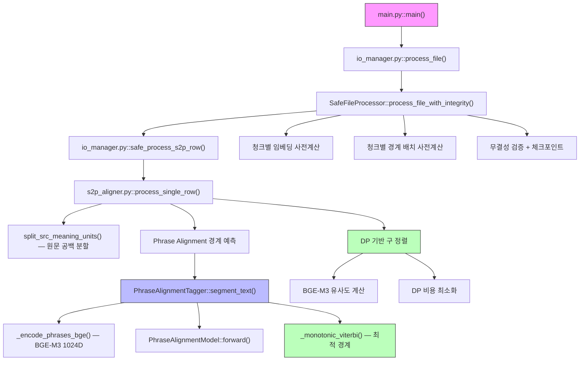
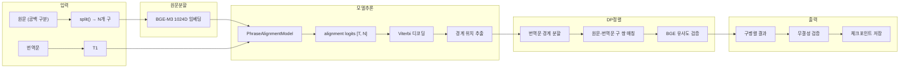

# S2P (Sentence-to-Phrase Aligner) 코드 해부

**버전**: 2026-02-10
**목적**: S2P 파이프라인의 함수 로직과 Phrase Alignment v2.1 모델 내부 구조를 상세 분석
**현재 F1**: 0.8555 (446문장 샘플, Docker RTX 3070 Ti)

---

## 0. 함수 호출 계층도 (Call Hierarchy)



---

## 0.1 알고리즘 흐름도 (Algorithm Flow)



---

## 1. Phrase Alignment Model v2.1 — 완전 해부

**관련 파일**:
- 모델 정의 (학습): `scripts/train_s2p_phrase_alignment.py`
- 모델 정의 (추론): `common/s2p_phrase_alignment_loader.py`
- 체크포인트: `models/s2p_phrase_alignment.pt`

이 모델의 임무는 **번역문(한국어)의 각 문자가 원문(한문)의 어느 구에 소속하는가를 예측**하는 것입니다. 소속 구가 바뀌는 지점이 곧 구 경계입니다.

### 1.1 v1→v2→v2.1 진화

| | v1 (CrossAttn Boundary) | v2 (Phrase Alignment) | v2.1 (현재) |
|---|---|---|---|
| 입력 | 문자 ID (128d) | BGE-M3 (1024d) | BGE-M3 (1024d) |
| Source 인코더 | 없음 | Linear | **Linear + BiLSTM** |
| 예측 | 문자별 B/O (2-class) | 문자별 소속 구 (N-class) | 문자별 소속 구 (N-class) |
| 경계 추출 | threshold 기반 | Viterbi | Viterbi |
| hidden | 256 | 256 | **512** |
| 학습 기법 | BCE | CE | **CE + Guided Attention** |
| F1 (446문장) | - | 69.00% | **85.55%** |

---

### 1.2 아키텍처 개요 (Architecture Overview)

```
클래스: PhraseAlignmentModel (common/s2p_phrase_alignment_loader.py)

입력 2종:
  src_embs   [B, N_max, 1024]  ← BGE-M3 원문 구별 임베딩 (사전계산)
  tgt_ids    [B, T_max]        ← 번역문 문자 ID 시퀀스

출력:
  alignment_logits  [B, T, N]  ← 각 문자의 구 소속 logits

※ N_max=64 (최대 구 개수), T_max=1024 (최대 번역문 길이)
```

#### 1.2.1 파이프라인 다이어그램

```
┌─────────────────────────────────────────────────────────────────┐
│                        FORWARD PASS                             │
│                                                                 │
│  ┌──────────────┐                                               │
│  │ src_embs     │                                               │
│  │ [B, N, 1024] │                                               │
│  └──────┬───────┘                                               │
│         ▼                                                       │
│  ┌────────────────┐                                             │
│  │  src_proj       │  Linear(1024 → 512) + LayerNorm + ReLU    │
│  └────────┬───────┘                                             │
│           ▼                                                     │
│  ┌────────────────┐                      ┌──────────────┐      │
│  │  src_encoder    │                     │ tgt_emb      │      │
│  │  BiLSTM(512→   │                     │ Embedding     │      │
│  │   256×2=512)   │                     │ (8000, 128)   │      │
│  └────────┬───────┘                      └──────┬───────┘      │
│           ▼                                     ▼               │
│  ┌────────────────┐                  ┌────────────────┐        │
│  │  src_norm       │                 │  tgt_encoder    │        │
│  │  LayerNorm(512) │                 │  BiLSTM(128→    │        │
│  └────────┬───────┘                  │   256×2=512)   │        │
│           │                          │  ×2 layers      │        │
│           │ src_h [B, N, 512]        └────────┬───────┘        │
│           │                                   ▼                 │
│           │                          ┌────────────────┐        │
│           │                          │  tgt_norm       │        │
│           │                          │  LayerNorm(512) │        │
│           │                          └────────┬───────┘        │
│           │                                   │ tgt_h [B, T, 512]
│           ▼                                   ▼                 │
│  ┌─────────────────────────────────────────────┐               │
│  │  Cross-Attention (MultiheadAttention)        │               │
│  │  query = tgt_h (번역문),  key/value = src_h (원문)│          │
│  │  num_heads=8, embed_dim=512                  │               │
│  └───────────────────┬─────────────────────────┘               │
│                      │ cross_out [B, T, 512]                    │
│                      ▼                                          │
│  ┌─────────────────────────────────────────────┐               │
│  │  cross_norm: LayerNorm(cross_out + tgt_h)   │  ← Residual   │
│  └───────────────────┬─────────────────────────┘               │
│                      │ tgt_enriched [B, T, 512]                 │
│                      ▼                                          │
│  ┌─────────────────────────────────────────────┐               │
│  │  alignment_proj: Linear(512 → 512)          │               │
│  └───────────────────┬─────────────────────────┘               │
│                      │ tgt_proj [B, T, 512]                     │
│                      ▼                                          │
│  ┌─────────────────────────────────────────────┐               │
│  │  Bilinear: tgt_proj @ src_h.T / temperature │               │
│  │  → [B, T, N] alignment logits               │               │
│  └───────────────────┬─────────────────────────┘               │
│                      ▼                                          │
│           alignment_logits [B, T, N]                            │
└─────────────────────────────────────────────────────────────────┘
```

---

### 1.3 각 레이어 상세

#### 1.3.1 Source Encoder: BGE Projection + BiLSTM (v2.1 핵심 추가)

```python
# Step 1: BGE 1024d → hidden 512d 프로젝션
self.src_proj = nn.Sequential(
    nn.Linear(1024, 512),
    nn.LayerNorm(512),
    nn.ReLU(),
    nn.Dropout(0.2),
)

# Step 2: BiLSTM — 구 간 순서와 문맥 학습
self.src_encoder = nn.LSTM(
    512, 256,           # hidden//2 = 256 (양방향 → 512)
    num_layers=1,
    bidirectional=True,
    batch_first=True,
)
self.src_norm = nn.LayerNorm(512)
```

**v2→v2.1의 핵심 변경**: v2에서는 `src_proj`만 있어 각 구가 독립적으로 처리되었습니다. v2.1에서는 **Source BiLSTM**을 추가하여 구 간의 **순서와 문맥**을 학습합니다.

**왜 필요한가?**: "子曰"(공자께서 말씀하셨다)이 첫 구로 올 때와 중간에 올 때의 의미가 다릅니다. BiLSTM은 구의 위치적 맥락(앞뒤 구의 내용)을 반영하여 더 정확한 정렬을 가능하게 합니다.

#### 1.3.2 Target Encoder: Character Embedding + BiLSTM

```python
# 문자 임베딩: 한국어 번역문의 각 문자를 128d로
self.tgt_emb = nn.Embedding(8000, 128, padding_idx=0)

# 2-layer BiLSTM: 양방향 문맥 포착
self.tgt_encoder = nn.LSTM(
    128, 256,           # hidden//2 = 256 (양방향 → 512)
    num_layers=2,       # 2층 — 더 깊은 문맥 학습
    bidirectional=True,
    batch_first=True,
    dropout=0.2,
)
self.tgt_norm = nn.LayerNorm(512)
```

**설계 의도**: 번역문은 문자 수준으로 처리합니다. BGE-M3 대신 문자 임베딩을 사용하는 이유:
1. **추론 효율**: BGE-M3를 두 번(원문 + 번역문) 호출하면 비용 2배
2. **경계 정밀도**: 문자 단위 표현이 구 경계 감지에 더 적합
3. **학습 용이**: 번역문 문자 패턴은 학습 데이터에서 직접 학습

#### 1.3.3 Cross-Attention (핵심 엔진)

```python
self.cross_attn = nn.MultiheadAttention(
    embed_dim=512,
    num_heads=8,       # 8개 헤드 × 64d = 512d
    batch_first=True,
    dropout=0.1,
)
self.cross_norm = nn.LayerNorm(512)
```

**작동 원리**:
- **query** = `tgt_h` (번역문의 각 문자)
- **key/value** = `src_h` (원문의 각 구)
- 번역문의 각 문자가 "원문의 어느 구와 의미적으로 대응하는가?"를 어텐션 가중치로 계산

**Residual Connection**: `cross_norm(cross_out + tgt_h)` — 원래의 번역문 문맥을 보존하면서 원문 참조 정보를 추가

**src_mask**: 원문 구가 N_max(64)보다 적을 때, 패딩된 구에는 어텐션이 가지 않도록 마스킹

#### 1.3.4 Alignment Projection + Temperature Scaling

```python
self.alignment_proj = nn.Linear(512, 512)
self.temperature = nn.Parameter(torch.ones(1))  # 학습 가능

# Forward:
tgt_proj = self.alignment_proj(tgt_enriched)     # [B, T, 512]
alignment_logits = torch.bmm(tgt_proj, src_h.T)  # [B, T, N]
alignment_logits = alignment_logits / self.temperature.abs().clamp(min=0.01)
```

**Bilinear Alignment**: 번역문의 각 문자 벡터와 원문의 각 구 벡터의 내적으로 유사도를 계산합니다. `alignment_proj`는 번역문 벡터를 원문 벡터 공간에 맞추는 선형 변환입니다.

**Temperature**: 학습 가능한 스케일링 파라미터로, logits의 분포를 조절합니다. 낮은 temperature → 더 확신 있는(sharp) 분포, 높은 temperature → 더 부드러운(smooth) 분포.

---

### 1.4 Viterbi 디코딩 (경계 추출)

**파일**: `common/s2p_phrase_alignment_loader.py`, 함수 `_monotonic_viterbi()`

모델이 출력한 `alignment_logits [T, N]`에서 최적 경계를 추출합니다.

#### 1.4.1 핵심 제약: 단조 증가 (Monotonic)

번역문의 구 소속은 **단조 증가**해야 합니다:
- 문자 1이 구 2에 소속되면, 문자 2는 구 2 이상에만 소속 가능
- 구 순서가 뒤바뀌는 것은 물리적으로 불가능 (번역 순서 = 원문 순서)

#### 1.4.2 알고리즘

```python
def _monotonic_viterbi(logits, n_phrases):
    """
    dp[t][n] = 위치 0..t까지, 위치 t가 구 n에 소속될 때의 최대 누적 점수

    전이 규칙:
      dp[t][n] = max(
          dp[t-1][n] + logits[t, n],      # 같은 구에 유지 (stay)
          dp[t-1][n-1] + logits[t, n],     # 이전 구에서 진행 (advance)
      )

    경계 조건:
      - 첫 문자: 반드시 구 0
      - 마지막 문자: 가능하면 구 N-1
    """
```

**시간 복잡도**: O(T × N) — 문자 수 × 구 수

#### 1.4.3 경계 추출

```python
# Viterbi 역추적으로 각 문자의 소속 구 결정
assignments = _monotonic_viterbi(logits, n_phrases)
# → [0, 0, 0, 1, 1, 1, 1, 2, 2, 2, ...]

# 소속 구가 바뀌는 지점 = 경계
boundaries = []
for t in range(1, tgt_len):
    if assignments[t] != assignments[t - 1]:
        boundaries.append(t)
# → [3, 7, ...]  (문자 인덱스)
```

---

### 1.5 학습 데이터 준비 (Data Pipeline)

**파일**: `scripts/train_s2p_phrase_alignment.py`

#### 1.5.1 입력 데이터

```
datasets/splits/phrase_train.xlsx → 구 단위 (책명, 문장식별자, 구식별자, 원문, 번역문)
```

#### 1.5.2 구 소속 라벨 생성

```python
def load_phrase_data(excel_path):
    """
    구 병렬 데이터에서 문장 단위로 그룹핑하여 라벨 생성.

    예: 문장의 구 쌍:
        구1: ("學而", "배우고")
        구2: ("時習之", "때때로 그것을 익히면")

    번역문 전체: "배우고 때때로 그것을 익히면"
    라벨:        [0,0,0, 1,1,1,1,1,1,1,1,1,1,1]
                 ↑구1   ↑구2 (공백도 새 구에 소속)
    """
```

**핵심**: 번역문의 각 문자에 대해 "이 문자가 원문의 몇 번째 구에 대응하는가"를 라벨로 생성. 구 사이 공백은 다음 구에 소속.

#### 1.5.3 BGE-M3 사전계산

```python
def precompute_bge_embeddings(samples, cache_path):
    """
    모든 고유 원문 구의 BGE-M3 dense embedding(1024d)을 사전계산.

    캐시 전략:
    1. 캐시 파일이 있으면 로드
    2. 현재 데이터에 없는 구가 있으면 추가 인코딩 (incremental)
    3. 없으면 전체 인코딩

    캐시: cache/bge_phrase_embeddings.pt
    형식: {"phrase_to_idx": {구: int}, "embeddings": [N, 1024]}
    """
```

**BGE 차원 이슈**: 반드시 `BGEM3FlagModel.encode()["dense_vecs"]` (1024d)를 사용해야 합니다. `EmbeddingManager.compute_embeddings_with_cache()` (1636d = dense+sparse+colbert)를 사용하면 차원 불일치로 오류 발생.

---

### 1.6 손실 함수 (Loss Functions)

#### 1.6.1 Cross-Entropy Loss (기본)

```python
loss = F.cross_entropy(
    logits.view(-1, n_max_phrases),   # [B*T, N]
    labels.view(-1),                  # [B*T]
    ignore_index=-100,                # 패딩 무시
)
```

각 문자가 N개 구 중 어디에 소속하는지를 분류하는 **N-class 분류 문제**입니다. 패딩된 위치(`labels=-100`)는 손실 계산에서 제외됩니다.

#### 1.6.2 Guided Attention Loss (v2.1 추가)

```python
def guided_attention_loss(attn_weights, src_lens, tgt_lens, sigma=0.2):
    """
    Attention이 대각선 패턴을 따르도록 유도하는 보조 손실.

    W[t,n] = 1 - exp(-((t/T - n/N)^2) / (2 * sigma^2))

    번역문의 t번째 문자가 원문의 n번째 구에 주의를 기울여야 할 때,
    이 가이드 행렬은 (t/T ≈ n/N)인 위치에서 낮은 값을 가짐.
    → 대각선 근처의 attention을 유도
    """
```

**설계 의도**: 한문→한국어 번역에서 구 순서는 대체로 보존됩니다(예: 원문의 첫 구가 번역문의 처음에 대응). Guided Attention은 이 선형 대응 관계를 soft constraint로 주입하여, 학습 초기에 모델이 올바른 정렬 패턴을 빠르게 학습하도록 돕습니다.

**가중치**: `guided_attn_weight=0.05` — 전체 손실의 5%로, CE 손실이 주도적이되 대각선 유도가 보조.

```python
total_loss = ce_loss + 0.05 * guided_attn_loss
```

---

### 1.7 학습 절차 (Training Procedure)

**파일**: `scripts/train_s2p_phrase_alignment.py`

#### 1.7.1 하이퍼파라미터

| 항목 | 값 | 비고 |
|------|-----|------|
| epochs | 100 | v2: 30 → v2.1: 100 |
| batch_size | 32 | 기본값 |
| optimizer | AdamW | lr=1e-3, weight_decay=0.01 |
| scheduler | CosineAnnealingLR | T_max=100, eta_min=1e-6 |
| grad_clip | 1.0 | `clip_grad_norm_` |
| patience | 15 | val boundary F1 개선 없으면 조기 종료 |
| hidden | 512 | v2: 256 → v2.1: 512 |
| num_heads | 8 | cross-attention heads |
| guided_attn_weight | 0.05 | v2.1 추가 |
| max_phrases | 64 | 최대 구 개수 |
| tgt_max_len | 1024 | 최대 번역문 문자 수 |
| model params | 6,742,529 | v2: 2,234,881 대비 3배 |

#### 1.7.2 Train/Val 분할

```python
split_by_book(samples, val_ratio=0.3, seed=42)
# 책 단위로 분리 → 모델이 특정 책의 문체를 암기하는 것을 방지
```

#### 1.7.3 학습 루프 (에포크당)

```
1. Forward: logits = model(src_embs, tgt_ids, src_mask)
2. CE Loss: cross_entropy(logits, labels, ignore_index=-100)
3. Guided Attn Loss: guided_attention_loss(attn_weights, ...)
4. Total: total_loss = ce_loss + 0.05 * guided_attn_loss
5. Backward: total_loss.backward()
6. Clip: clip_grad_norm_(params, 1.0)
7. Step: optimizer.step() + scheduler.step()
8. Validate: boundary F1 + char accuracy 계산
9. Save: val boundary F1 개선 시 best checkpoint 저장
```

#### 1.7.4 검증 지표

| 지표 | 정의 | 최종 결과 |
|------|------|----------|
| **Boundary F1** | 경계 위치 예측의 F1 | 0.7755 |
| **Char Accuracy** | 각 문자의 소속 구 정확도 | 0.9003 |

**v2 대비**: Boundary F1 0.5294 → 0.7755 (+47%), Char accuracy 0.6908 → 0.9003 (+30%)

#### 1.7.5 체크포인트 구조

```python
checkpoint = {
    "state_dict":     model.state_dict(),
    "tgt_vocab":      dict,        # {문자: ID}
    "tgt_max_len":    1024,
    "max_phrases":    64,
    "hidden":         512,
    "tgt_emb_dim":    128,
    "bge_dim":        1024,
}
```

---

## 2. 추론 흐름 (Inference Pipeline)

**파일**: `common/s2p_phrase_alignment_loader.py`

### 2.1 로더 초기화

```python
class PhraseAlignmentTagger:
    def __init__(self, model_path, device="cuda"):
        # 1. 체크포인트에서 하이퍼파라미터 복원 (hidden, bge_dim, tgt_vocab 등)
        # 2. 모델 재구성 + state_dict 로드 + eval() 모드
        # 3. BGE-M3는 lazy loading (첫 사용 시 로드)
```

### 2.2 핵심 추론 메서드

**`predict_boundaries(src_phrases, tgt_text, src_phrase_embeddings)`**:

```
원문 구 리스트 + 번역문 텍스트
  → BGE-M3로 구 임베딩 (또는 사전계산값 사용)
  → 모델 forward → alignment logits [1, T, N]
  → Viterbi 디코딩 → 각 문자의 소속 구
  → 소속 구 변경 지점 = 경계 위치 리스트
```

**`segment_text(src_text, tgt_text)`**:

```
1. src_text.split() → 원문 구 리스트
2. predict_boundaries() → 경계 위치
3. 경계 위치로 번역문 분할
4. 빈 세그먼트 병합 (이전/이후에 결합)
5. 세그먼트 리스트 반환
```

### 2.3 BGE 임베딩 처리

```python
def _encode_phrases_bge(self, phrases, precomputed=None):
    """
    원문 구의 BGE 임베딩을 계산하거나 사전계산값을 사용.

    세 가지 경로:
    1. precomputed가 있으면 직접 사용 (가장 빠름)
    2. EmbeddingManager가 있으면 내부 BGEM3FlagModel.encode() 사용 (1024d)
    3. BGEM3FlagModel 직접 사용 (1024d)

    주의: compute_embeddings_with_cache() (1636d)는 사용 금지!
    cross-lingual(한문→한국어)에서 sparse/colbert는 노이즈.
    """
```

---

## 3. S2P 파이프라인 전체 흐름

### 3.1 main.py → io_manager.py → s2p_aligner.py

```
main.py::main()
  ├─ argparse: --use-phrase-alignment, --use-boundary-model 등
  ├─ _preload_models(): GPU에 모델 미리 로드
  └─ process_file()

io_manager.py::process_file()
  └─ SafeFileProcessor::process_file_with_integrity()
       ├─ 데이터 로드 + NaN 처리 + 편집 마커([, -, ]) 제거
       ├─ 청크 단위 처리:
       │    ├─ 청크별 BGE 임베딩 사전계산
       │    ├─ 청크별 경계 배치 사전계산 (segment_text_batch)
       │    └─ 행 단위 process_single_row() 실행
       ├─ 무결성 검증 (원문/번역문 문자 수 보존)
       └─ 체크포인트 CSV 저장
```

### 3.2 편집 마커 제거

```python
# io_manager.py, line 99-104
_marker_tr = str.maketrans("", "", "[-]")
for _col in ["원문", "번역문"]:
    df[_col] = df[_col].str.translate(_marker_tr)
```

입력 데이터에 `[-俾]` 형태의 편집 주석이 있을 수 있습니다. `[`, `-`, `]` 문자를 제거하여 모델 입력을 정규화합니다. P2S와 동일한 전처리입니다.

### 3.3 process_single_row() 내부 흐름

**파일**: `s2p/s2p_aligner.py`

```
1. 원문을 공백으로 분할 → N개 구 (split_src_meaning_units)
2. 사전계산된 경계 결과가 있으면 사용 (_precomputed_tgt_segments)
   없으면: Phrase Alignment 모델로 번역문 분할
3. 원문 구와 번역문 세그먼트 매칭 (DP 기반)
4. BGE-M3 유사도로 매칭 품질 검증
5. 결과 dict 리스트 반환
```

---

## 4. 원문 분할 로직

### 4.1 공백 기반 분할 (핵심 원칙)

```python
def split_src_meaning_units(text, **kwargs):
    """
    S2P 핵심 원칙: 원문은 무조건 공백 단위로만 분할.
    사용자가 입력한 공백 구조를 그대로 보존.

    예: "學而 時習之 不亦說乎"
    → ["學而", "時習之", "不亦說乎"]  (3개 구)
    """
    return text.split()
```

**분석용 토크나이저** (반환값에 영향 없음):
- **한자 패턴** (`\p{Han}+`): SikuBERT 기준 한자 토큰 추출
- **Kiwipiepy**: 형태소 분석으로 한글 현토(하사대, 호되 등) 인식

---

## 5. 번역문 경계 분할

### 5.1 Phrase Alignment 모델 경로 (v2.1)

배치 사전계산된 결과를 우선 사용:

```python
# io_manager.py에서 청크별로 사전계산
segments_batch = boundary_model.segment_text_batch(
    chunk_src,
    chunk_tgt,
    n_segments_list=chunk_n_segments,
    threshold=boundary_threshold,
)
```

### 5.2 DP 기반 폴백 경로

Phrase Alignment 모델이 없거나 결과가 부적절할 때:

```
1. BGE-M3로 원문 구별 + 번역문 전체 임베딩
2. 유사도 행렬 계산 [N_src × N_tgt_tokens]
3. DP로 최적 번역문 경계 탐색
   - 비용 함수: 유사도 + 위치 거리 감쇠 + 경계 보너스 + 길이 패널티
4. 최적 경계 위치에서 번역문 분할
```

---

## 6. 무결성 검증 시스템

### 6.1 행 수준 검증

```python
# io_manager.py::_verify_row_integrity()
original_src = "원문 전체"
processed_src = "".join(분할된 원문 구들)
# → integrity_guard.verify_integrity()로 문자 보존 확인
```

### 6.2 파일 수준 검증

```python
# io_manager.py::_verify_final_integrity()
original_src_all = "".join(전체 입력 원문)
result_src_all = "".join(전체 출력 원문)
# → 공백/개행/탭 제거 후 순수 문자만 비교
```

### 6.3 체크포인트

청크 처리 완료 시마다 `{output}_checkpoint.csv`에 중간 결과를 저장합니다. 중단 후 재실행 시 이 파일에서 이어서 처리할 수 있습니다.

---

## 7. 캐시 레이어 해부 (Cache Anatomy)

| 캐시 | 위치 | 내용 | 효과 |
|------|------|------|------|
| **BGE 구 캐시** | `cache/bge_phrase_embeddings.pt` | 모든 고유 원문 구의 BGE 1024d | 학습 시 BGE 재호출 방지 |
| **BGE 임베딩 캐시** | 메모리 (EmbeddingManager) | 텍스트 → 1636d | 추론 시 중복 임베딩 방지 |
| **경계 배치 캐시** | 메모리 (batch_boundary_cache) | 행 인덱스 → 분할 결과 | 청크별 배치 처리 결과 캐싱 |
| **모델 싱글톤** | `safe_process_s2p_row._boundary_model` | GPU 상주 모델 | 모델 재로드 방지 |
| **체크포인트** | `{output}_checkpoint.csv` | 청크별 중간 결과 | 중단 복구 |

---

## 8. 평가 시스템

**파일**: `accuracy/s2p_evaluator.py`

### 8.1 평가 방법론: Src Exact Subset

```python
def evaluate_src_exact_subset(gold_df, pred_df):
    """
    1. 정규화: 공백/개행/탭 제거
    2. 키 생성: (book_name, 문장식별자, 원문_정규화)
    3. Gold-Pred 공통 키 추출
    4. 공통 키 내에서 번역문 비교:
       - 동일 키의 번역문을 연결 (다중 구 → 하나로)
       - Exact match이면 TP
       - 아니면 SequenceMatcher로 유사도 계산
    5. F1 = 2PR / (P+R), Precision=1.0 (src exact subset이므로 FP 없음)
    """
```

### 8.2 지표

| 지표 | 정의 |
|------|------|
| **F1** | 번역문 exact match 기반 F1 (Precision은 항상 1.0) |
| **Recall** | 번역문 exact match 수 / 전체 공통 키 수 |
| **Avg Similarity** | SequenceMatcher 기반 평균 문자열 유사도 |
| **Sim >= 0.9** | 유사도 90% 이상인 비율 |

### 8.3 전역 무결성 검증

```python
pred_src_global = normalize("".join(pred_df["원문"]))
gold_src_global = normalize("".join(gold_df["원문"]))
is_global_integrity_ok = (pred_src_global == gold_src_global)
```

---

## 9. 전체 워크플로우 요약

1. **Load**: 데이터 + 모델 로드 (Phrase Alignment, BGE-M3)
2. **Preprocess**: NaN 처리 + 편집 마커 제거
3. **Chunk**: 청크(200행) 단위로 분할
4. **Embed**: 청크별 BGE 임베딩 사전계산
5. **Predict**: 청크별 Phrase Alignment 경계 배치 추론
6. **Process Row**: 행별 원문 분할 + 번역문 분할 + 매칭
7. **Verify**: 행별 무결성 검증
8. **Checkpoint**: 청크 완료 시 중간 CSV 저장
9. **Final Verify**: 파일 수준 무결성 검증
10. **Output**: XLSX 저장

---

## 10. 성능 벤치마크

### 10.1 모델 비교 (446문장, P2S 100문단 기반 샘플)

| 방식 | F1 | Recall | Precision | 평균 유사도 |
|------|-----|--------|-----------|-----------|
| **v2.1 Phrase Alignment** | **0.8555** | 0.7475 | 1.0 | 0.9362 |
| v2 Phrase Alignment | 0.6900 | 0.5267 | 1.0 | 0.8461 |
| v1 CrossAttn Boundary | 0.1084 | 0.0573 | 1.0 | 0.4591 |
| Baseline (DP only) | 0.1563 | 0.0848 | 1.0 | - |

### 10.2 학습 비교

| 지표 | v2 | v2.1 | 변화 |
|------|-----|------|------|
| Val boundary F1 | 0.5294 | 0.7755 | +47% |
| Char accuracy | 0.6908 | 0.9003 | +30% |
| Model params | 2,234,881 | 6,742,529 | x3 |
| 학습 시간 | ~1시간 | ~2.5시간 | RTX 3070 Ti (8GB) |

### 10.3 v2→v2.1 핵심 변경 요인

1. **Source BiLSTM**: 구 간 순서/문맥 학습 → 정렬 정확도 향상
2. **hidden 256→512**: 모델 용량 확장 → 더 복잡한 패턴 포착
3. **Guided Attention Loss**: 대각선 정렬 유도 → 학습 초기 수렴 가속
4. **epoch 30→100**: CosineAnnealing LR로 충분한 수렴

---

## 부록 A: 이전 CrossAttn Boundary Model (v1, 비활성화)

**파일**: `common/s2p_crossattn_boundary_loader.py`

v1은 문자 수준 B/O(Boundary/Other) 예측 모델이었으나, S2P downstream에서 F1=0.1084로 비효과적이라 확인되어 비활성화되었습니다.

### A.1 v1이 실패한 이유

1. **문자 수준 예측의 한계**: 구 경계는 의미 단위 간의 전환이지만, 128d 문자 임베딩으로는 의미 포착 불가
2. **BGE 부재**: 원문-번역문 간 cross-lingual 의미 정보 없이 문자 패턴만으로 경계 예측
3. **N:M 대응 불일치**: 경계 모델이 예측하는 세그먼트 개수가 원문 구 개수와 불일치

### A.2 v2가 해결한 것

1. **BGE-M3 의미 주입**: 원문 구의 1024d 의미 벡터를 직접 사용
2. **N-class 소속 예측**: 문자별 소속 구를 직접 예측 → 개수 불일치 문제 해소
3. **Viterbi 단조 제약**: 구 순서 보존을 강제하여 물리적으로 불가능한 정렬 제거

---

## 부록 B: CLI 옵션 요약

```bash
# v2.1 Phrase Alignment 사용 (권장)
python -u -m s2p.main input.xlsx output.xlsx \
    --use-phrase-alignment \
    --preload-models \
    --no-parallel \
    --chunk-size 200

# v1 CrossAttn Boundary 사용 (비권장)
python -u -m s2p.main input.xlsx output.xlsx \
    --use-boundary-model \
    --no-parallel

# DP only (baseline)
python -u -m s2p.main input.xlsx output.xlsx \
    --no-boundary-model \
    --no-parallel
```

| 옵션 | 기본값 | 설명 |
|------|--------|------|
| `--use-phrase-alignment` | False | v2.1 Phrase Alignment 모델 사용 |
| `--use-boundary-model` | True | v1 CrossAttn Boundary 모델 사용 |
| `--no-boundary-model` | - | 경계 모델 비활성화 (DP only) |
| `--preload-models` | False | GPU에 모델 미리 로드 (대용량 처리 시 권장) |
| `--chunk-size` | 200 | 청크 크기 |
| `--batch-size` | 32 | GPU 배치 크기 (OOM 방지) |
| `--similarity-threshold` | 0.50 | DP 유사도 임계값 |
| `--device` | cuda | cuda/cpu |
