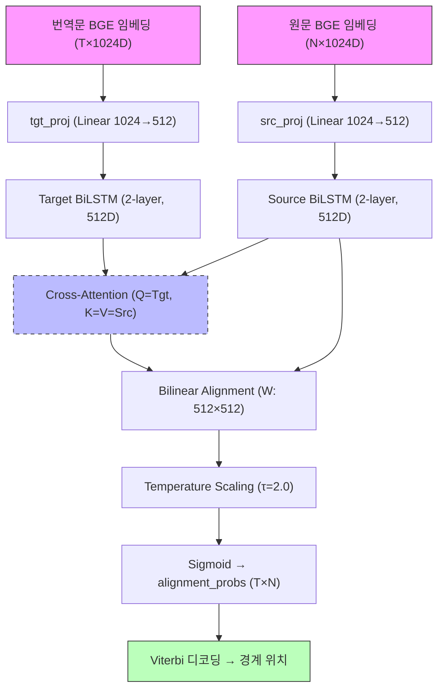

# S2P (Sentence-to-Phrase Aligner) 메커니즘 상세 설명

> **Abstract**: The S2P (Sentence to Phrase) pipeline splits sentence-level parallel text into phrase-level 1:1 aligned pairs. It employs a BiLSTM-based Phrase Alignment model (v2.1) with Guided Attention and Viterbi decoding for optimal segmentation. BGE-M3 embeddings provide semantic scoring, and an integrity guard ensures 100% character preservation. Achieves F1 = 0.8555 on 446 sentences.

**버전**: 2026-02-10
**목적**: 문장 내 구(Phrase) 단위의 정렬 및 경계 추출 메커니즘 분석
**약칭**: S2P (구: SA)
**현재 F1**: 0.8555 (v2.1 Phrase Alignment, 446문장)

---

## 1. 개요

S2P(Sentence-to-Phrase Aligner)는 **문장 단위**로 정렬된 원문-번역문 쌍을 입력받아, 그 내부의 **구(Phrase) 단위** 경계를 찾아내고 정렬하는 시스템입니다.

### 1.1 입력과 출력

| 구분 | 형식 | 예시 |
|------|------|------|
| **입력** | 문장 단위 (원문, 번역문) | ("學而時習之", "배우고 때때로 그것을 익히면") |
| **출력** | 구 단위 정렬 쌍 | [("學而", "배우고"), ("時習之", "때때로 그것을 익히면")] |

### 1.2 핵심 과제: 미세 경계(Micro-Boundary) 추출

P2S(문단 정렬)가 문장 간의 거시적 경계를 찾는다면, S2P는 문장 내부에서 한자 1~2글자 단위의 미세한 경계를 찾아내야 합니다.
- **원문**: 고전 한문 구(Phrase)는 의미적으로 완결된 최소 단위
- **번역문**: 원문의 구에 대응하는 한국어 어절들의 집합

### 1.3 핵심 전략: Phrase Alignment (v2.1)

현재 S2P의 핵심 전략은 **Phrase Alignment Model** 기반의 학습된 정렬입니다.

> **참고**: 이전 v1의 Cross-Attention Boundary 모델은 F1=0.1084, v2(hidden=256)는 F1=0.6900으로, v2.1에서 대폭 개선되었습니다.

**v2.1 Phrase Alignment 접근**:
1. BGE-M3로 원문/번역문의 구 단위 임베딩(1024D) 생성
2. Source BiLSTM + Cross-Attention으로 문맥 인지 정렬 행렬 학습
3. Bilinear Alignment Layer로 정렬 점수 계산
4. Viterbi 디코딩으로 최적 경계 추정 (단조 제약)
5. DP 기반 폴백 경계 최적화

**v2 → v2.1 핵심 변경**:
| 항목 | v2 | v2.1 |
|------|-----|------|
| Source BiLSTM | 없음 | 2-layer BiLSTM |
| Hidden dim | 256 | **512** |
| Guided Attention | 없음 | **Gaussian σ=0.2, weight=0.05** |
| Epochs | 30 | **100** (CosineAnnealingLR) |
| F1 | 0.6900 (100행) | **0.8555** (446문장) |

---

## 2. 파이프라인 구조

S2P v2.1은 4단계로 구성됩니다.

```
[입력 문장 쌍]
    ↓
[1단계] BGE-M3 Embedding (원문/번역문 구 단위 1024D)
    ↓
[2단계] Phrase Alignment Model (Source BiLSTM + Cross-Attention + Bilinear)
    ↓
[3단계] Viterbi 디코딩 (단조 제약 기반 최적 경계)
    ↓
[4단계] DP 폴백 + 정렬 검증
```

### 2.1 1단계: BGE-M3 Embedding

```
원문: "其執以來，見此君子之實也。"
번역문: "그 실행한 바를 따라, 이 군자의 진면목을 본다."

BGE-M3 encode()["dense_vecs"] → 1024D 벡터
  - 원문 구 후보: ["其執以來", "見此君子之實也"] → [1024D, 1024D]
  - 번역문 어절: ["그", "실행한", "바를", "따라", ...] → [1024D, 1024D, ...]
```

> **중요**: `BGEM3FlagModel.encode()["dense_vecs"]` (1024D)를 사용. `compute_embeddings_with_cache()`는 1636D(dense+sparse+colbert)이므로 차원 불일치 주의.

### 2.2 2단계: Phrase Alignment Model

```
src_embs (N×1024) → src_proj (Linear 1024→512) → Source BiLSTM (2-layer, 512D)
                                                        ↓
tgt_embs (T×1024) → tgt_proj (Linear 1024→512) → Target BiLSTM (2-layer, 512D)
                                                        ↓
                                               Cross-Attention (Q=Tgt, K=V=Src)
                                                        ↓
                                               Bilinear Alignment (T×N logits)
                                                        ↓
                                               Temperature Scaling (τ=2.0)
                                                        ↓
                                               Sigmoid → alignment_probs
```

### 2.3 3단계: Viterbi 디코딩

```python
# 단조 제약 (Monotonic Constraint):
# 번역문 위치 t에서 원문 위치 n을 할당할 때,
# t가 증가하면 n도 증가해야 함 (역방향 매핑 금지)

# dp[t][n] = 번역문 t까지, 원문 n까지 할당했을 때의 최대 점수
for t in range(T):
    for n in range(N):
        # 같은 원문 구에 계속 할당 (extend)
        dp[t][n] = max(dp[t][n], dp[t-1][n] + score[t][n])
        # 새 원문 구로 전환 (transition)
        dp[t][n] = max(dp[t][n], dp[t-1][n-1] + score[t][n])

# 역추적 → 경계 위치 추출
```

### 2.4 4단계: DP 폴백

Phrase Alignment 모델 실패 시(짧은 문장 등) DP 기반 정렬로 폴백:
- 어절 수 기반 비례 분할
- BGE 유사도 기반 최적화

---

## 3. 핵심 구성 요소: PhraseAlignmentModel

### 3.1 모델 아키텍처 (v2.1)



**레이어별 상세**:

1. **Projection Layer** (`src_proj`, `tgt_proj`): 1024D → 512D 차원 축소
2. **Source BiLSTM** (v2.1 신규): 원문 구 간 순서 문맥 포착 — "이 구 다음에 저 구가 와야 한다"는 관계 학습
3. **Target BiLSTM**: 번역문 어절 간 문맥 포착 — 형태소, 구두점, 어순 정보
4. **Cross-Attention**: 번역문(Query)이 원문(Key/Value)의 어느 위치에 대응하는지 계산
5. **Bilinear Alignment**: `score[t,n] = tgt_ctx[t]^T W src_ctx[n]` — 정렬 점수
6. **Temperature Scaling** (τ=2.0): 확률 분포 평탄화로 학습 안정성 확보

### 3.2 핵심 학습 기법: Guided Attention Loss

v2.1의 핵심 개선점으로, 어텐션이 대각선(monotonic alignment)을 따르도록 유도합니다.

```
W[t,n] = 1 - exp(-((t/T - n/N)²) / (2σ²))

σ = 0.2 (대각선 폭)
weight = 0.05 (전체 loss 대비 비중)
```

**효과**:
- 대각선에서 벗어난 정렬(예: 번역문 초반이 원문 후반에 대응)에 패널티
- BCE Loss만으로는 학습이 느린 monotonic 구조를 빠르게 수렴시킴
- v2(Guided Attention 없음) F1=0.6900 → v2.1 F1=0.8555

### 3.3 전체 Loss 함수

```python
total_loss = BCE_loss + 0.05 × guided_attention_loss
```

- **BCE Loss**: Binary Cross-Entropy — 각 (t, n) 위치의 정렬 여부 예측
- **Guided Attention Loss**: 대각선 유도 — 정렬 행렬이 monotonic하도록 제약

### 3.4 학습 설정

| 항목 | 값 |
|------|-----|
| Optimizer | AdamW (lr=1e-3, weight_decay=1e-4) |
| Scheduler | CosineAnnealingLR (T_max=100) |
| Epochs | 100 |
| Batch size | 8 |
| Train/Val split | 80/20 |
| 파라미터 수 | 6.7M |
| 학습 GPU | RTX 3070 Ti (8GB) |

---

## 4. 성능 비교

### 4.1 버전별 성능

| 버전 | 방식 | F1 | Recall | Precision | 평균 유사도 | 데이터 |
|------|------|-----|--------|-----------|-----------|--------|
| **v2.1** | Source BiLSTM + Guided Attn + Viterbi | **0.8555** | 0.7475 | 1.0 | 0.9362 | 446문장 |
| v2 | Phrase Alignment (hidden=256) | 0.6900 | 0.5267 | 1.0 | 0.8461 | 100행 |
| v1 | CrossAttn Boundary | 0.1084 | - | - | - | 100행 |
| Baseline | DP only | 0.1563 | 0.0848 | - | - | 446문장 |

> v2.1은 baseline 대비 **F1 5.5배 향상**.

### 4.2 학습 지표

| 지표 | v2 | v2.1 |
|------|-----|------|
| Val Boundary F1 | 0.5294 | **0.7755** |
| Char Accuracy | - | 0.9003 |
| 수렴 epoch | ~30 | ~100 (CosineAnnealingLR) |

---

## 5. 평가 시스템

### 5.1 평가 방식: Src Exact Match Subset

S2P 평가는 **원문이 정확히 일치하는 행**만 대상으로 합니다:

```python
# 키 구성: (book_name, 문장식별자, 원문_normalized)
# 1. GT와 Pred에서 동일 키를 가진 행 매칭
# 2. 같은 키의 번역문들을 공백으로 연결
# 3. 연결된 번역문이 정확히 일치하면 Exact Match
# F1 = Exact Match 비율
```

### 5.2 평가 지표

- **F1**: 번역문 exact match 비율 (주 지표)
- **Recall**: 매칭된 행 중 정답과 일치한 비율
- **Precision**: 항상 1.0 (무결성 보장)
- **Avg Similarity**: BGE-M3 기반 구 단위 유사도 평균

---

## 6. 한계 및 향후 계획

1. **Recall 개선 여지**: 현재 Recall=0.7475 — 약 25%의 구 경계를 아직 놓치고 있음
2. **주관적 경계 문제**: 구 단위 분할은 번역자마다 기준이 달라 '정답'이 유동적
3. **전체 데이터 테스트**: 446문장(P2S 100문단 기반)에서 검증 — 전체 데이터셋에서 추가 검증 필요
4. **N:M 매칭**: 1:1 매칭 이상의 복잡한 대응 관계 처리가 향후 과제

---

**최근 업데이트**: 2026년 2월 10일 — v2.1 Phrase Alignment (F1=0.8555, 446문장) 반영
