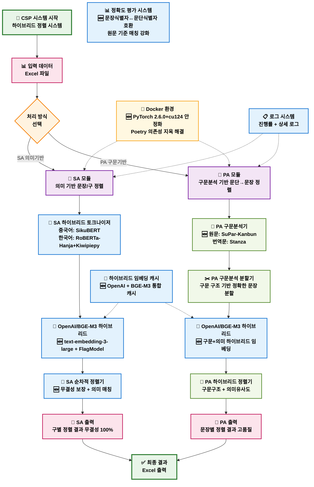
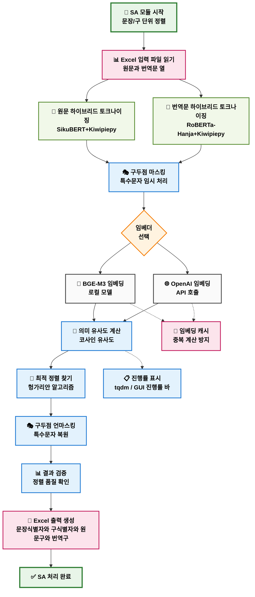
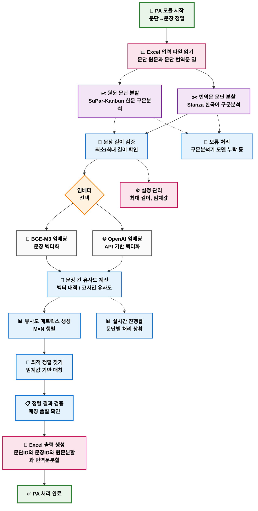
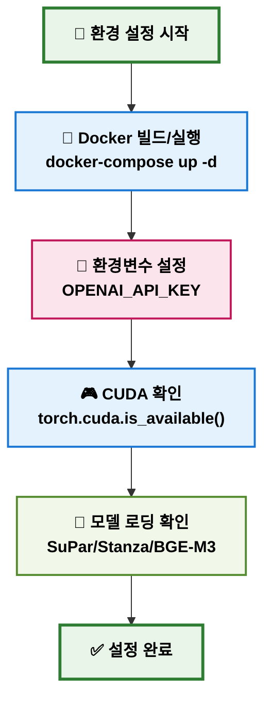
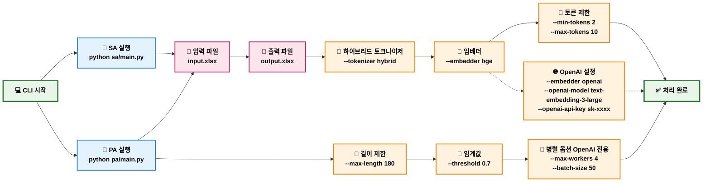
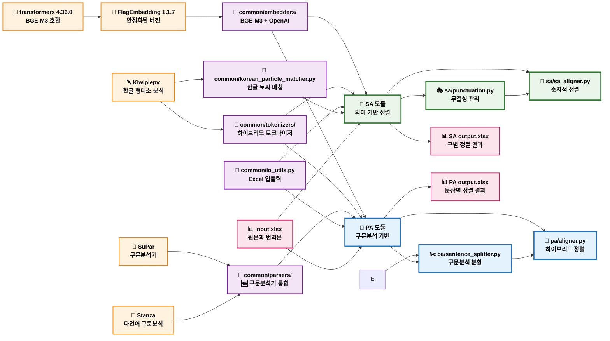
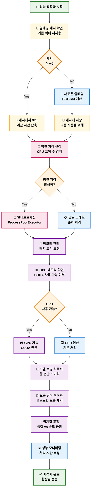
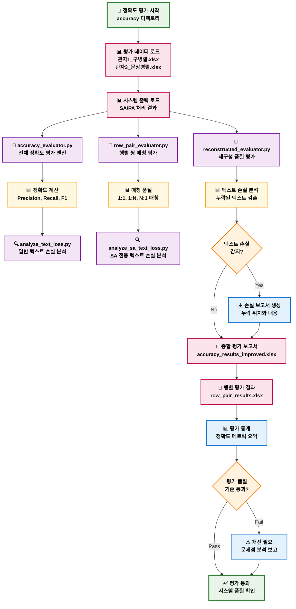
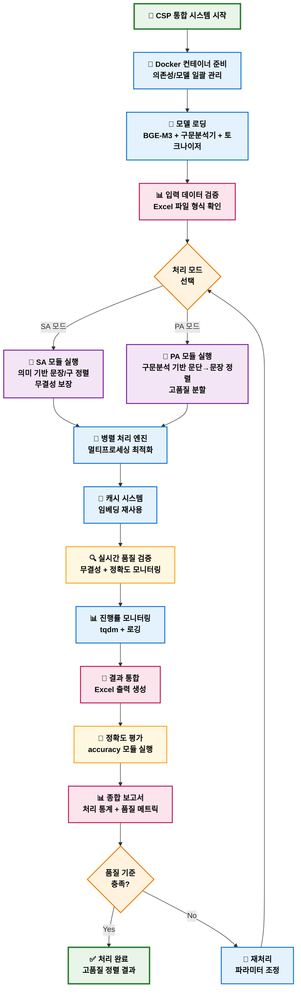

## CSP 프로젝트 전체 워크플로우 (2025-08-28 업데이트)

## 프로젝트 개요
CSP(Chinese-Korean Sentence Pairing)는 한문-한국어 번역 텍스트의 자동 정렬 시스템입니다. SA(문장/구 정렬)와 PA(문단→문장 정렬) 두 가지 모듈로 구성되어 있으며, **차별화된 접근 방식**을 사용합니다.

**🆕 2025-08-28 주요 업데이트:**
- **PA 병렬 옵션 전달 버그 수정**: `split_source_by_whitespace_and_align()` 시그니처 확장으로 `--max-workers`, `--batch-size`가 정상 반영됩니다(OpenAI 전용).
- **문서 정리**: Poetry 관련 내용 제거, Docker 중심 가이드로 일원화.

**🆕 2025-08-24 주요 업데이트:**
- **🐳 Docker 환경**: PyTorch 2.6.0+cu124 안정화, 일관된 재현성 확보
- **PA**: 구문분석 기반 (SuPar-Kanbun + Stanza + OpenAI/BGE-M3 하이브리드)
- **SA**: 의미 기반 (하이브리드 토크나이저 + OpenAI/BGE-M3 하이브리드)
- **OpenAI 통합**: text-embedding-3-large 모델 완전 지원
- **정확도 평가**: 문장식별자↔문단식별자 호환, 원문 기준 매칭 강화
- **무결성 시스템**: SA 순차적 텍스트 처리로 단어 순서 보장

---

## 전체 시스템 아키텍처 플로우차트


```

---

## SA 모듈 상세 워크플로우



---

## PA 모듈 상세 워크플로우



---

## 환경 설정 및 의존성 플로우차트 (Docker 중심)



---

## CLI 사용법 플로우차트 (PA 병렬 옵션 반영)



---

## 주요 특징

### ✨ 핵심 기능
- **SA 모듈**: 문장/구 단위 정밀 정렬 (하이브리드 토크나이저)
- **PA 모듈**: 문단→문장 분할 및 정렬 (SuPar-Kanbun + Stanza + BGE-M3)
- **다중 임베더**: BGE-M3 (로컬) + OpenAI (API) 지원
- **실시간 모니터링**: CLI tqdm + GUI 진행률 바
- **캐시 시스템**: 임베딩 결과 재사용으로 성능 최적화

### 🔧 기술 스택
- **토크나이저**: SikuBERT (중국어), RoBERTa-Hanja+Kiwipiepy (한국어)
- **구문분석**: SuPar-Kanbun (한문), Stanza (한국어) + 하이브리드 토크나이저
- **임베딩**: BGE-M3, OpenAI text-embedding-3-large
- **정렬 알고리즘**: 헝가리안 알고리즘, 임계값 기반 매칭
- **입출력**: Excel (xlsx) 파일 지원

### 📊 처리 성능
- **대용량 처리**: 수천 문장 단위 배치 처리
- **고품질 정렬**: 의미 기반 유사도 매칭
- **환경 최적화**: Poetry 의존성 관리 및 가상환경
- **멀티플랫폼**: Windows/Linux/WSL 지원

### 🚀 사용 시나리오
- **학술 연구**: 한문 고전 번역 정렬
- **대용량 코퍼스**: 병렬 말뭉치 구축
- **번역 품질 평가**: 원문-번역문 대응 분석
- **자동화 파이프라인**: CLI 기반 배치 처리

---

## Common 디렉토리 공통 모듈 플로우차트

```mermaid
flowchart TB
    %% 스타일 정의
    classDef startEnd fill:#e8f5e8,stroke:#2e7d32,stroke-width:3px,color:#000,font-weight:bold
    classDef core fill:#e3f2fd,stroke:#1976d2,stroke-width:2px,color:#000,font-weight:bold
    classDef embedder fill:#f3e5f5,stroke:#7b1fa2,stroke-width:2px,color:#000,font-weight:bold
    classDef tokenizer fill:#fff3e0,stroke:#f57c00,stroke-width:2px,color:#000,font-weight:bold
    classDef parser fill:#f1f8e9,stroke:#558b2f,stroke-width:2px,color:#000,font-weight:bold
    classDef utility fill:#fce4ec,stroke:#c2185b,stroke-width:2px,color:#000,font-weight:bold
    classDef cache fill:#fff8e1,stroke:#f9a825,stroke-width:2px,color:#000,font-weight:bold
    
    A[🚀 Common 모듈 시작<br/>공통 기능 라이브러리]:::startEnd
    
    %% 임베더 모듈
    B[🧠 embedders/ 디렉토리<br/>임베딩 엔진 모음]:::embedder
    C[🤖 bge.py<br/>BGE-M3 FlagModel 래퍼<br/>안정화된 임베딩 엔진]:::embedder
    D[🌐 openai_embedder.py<br/>OpenAI API 래퍼<br/>text-embedding-3-large]:::embedder
    
    %% 토크나이저 모듈
    E[🏮 tokenizers/ 디렉토리<br/>하이브리드 토크나이저 모음]:::tokenizer
    F[📚 siku_bert.py<br/>SikuBERT 토크나이저<br/>사고전서 코퍼스 훈련]:::tokenizer
    H[📚 roberta_hanja.py<br/>RoBERTa-Hanja 토크나이저<br/>한자 포함 한국어]:::tokenizer
    I[📚 kiwipiepy_wrapper.py<br/>Kiwipiepy 래퍼<br/>한글 형태소 분석]:::tokenizer
    
    %% 구문분석기 모듈
    J[🏮 parsers/ 디렉토리<br/>🆕 구문분석기 모음]:::parser
    K[🏮 supar_kanbun.py<br/>🆕 SuPar-Kanbun 래퍼<br/>한문 구문분석기]:::parser
    L[🏮 stanza_korean.py<br/>🆕 Stanza 래퍼<br/>한국어 구문분석기]:::parser
    M[🏮 new_parsers.py<br/>🆕 통합 구문분석기<br/>SuPar + Stanza 연동]:::parser
    
    %% 유틸리티 모듈
    N[🔧 io_utils.py<br/>Excel 입출력 유틸리티<br/>pandas 래퍼]:::utility
    O[🏮 korean_particle_matcher.py<br/>한글 토씨 매칭<br/>Kiwipiepy 연동]:::utility
    P[📊 progress_manager.py<br/>진행률 관리<br/>tqdm + 로깅]:::utility
    
    %% 캐시 시스템
    Q[💾 cache/ 디렉토리<br/>임베딩 캐시 관리]:::cache
    R[💾 embedding_cache.py<br/>BGE-M3 캐시 관리<br/>pickle 기반 저장]:::cache
    S[💾 model_cache.py<br/>모델 캐시 관리<br/>transformers 캐시]:::cache
    
    A --> B
    A --> E
    A --> J
    A --> N
    A --> Q
    
    %% 임베더 관계
    B --> C
    B --> D
    
    %% 토크나이저 관계
    E --> F
    E --> G
    E --> H
    E --> I
    
    %% 구문분석기 관계
    J --> K
    J --> L
    J --> M
    
    %% 유틸리티 관계
    N --> O
    N --> P
    
    %% 캐시 관계
    Q --> R
    Q --> S
```



---

## 모듈 간 의존성 플로우차트



---

## 성능 최적화 플로우차트



---

## Accuracy 디렉토리 평가 모듈 플로우차트



---

## 전체 시스템 통합 플로우차트 (Docker 중심)



---

## 📋 종합 요약

### 🎯 CSP 시스템 특징
1. **이중 모듈 아키텍처**: SA(의미 기반) + PA(구문분석 기반)
2. **하이브리드 접근법**: 토크나이저 + 구문분석기 + 임베딩 통합
3. **무결성 보장**: 순차적 텍스트 처리로 단어 순서 유지
4. **성능 최적화**: 병렬 처리 + 캐시 시스템 + GPU 가속
5. **품질 평가**: 정확도 모듈로 실시간 품질 검증

### 🔧 핵심 기술 스택
- **BGE-M3 FlagModel**: 안정화된 1024차원 임베딩
- **SuPar-Kanbun**: 한문 구문분석 (PA 모듈)
- **Stanza**: 한국어 구문분석 (PA 모듈)  
- **하이브리드 토크나이저**: SikuBERT + RoBERTa-Hanja + Kiwipiepy
- **Poetry**: 의존성 관리 및 가상환경

### 📊 처리 플로우
1. **입력**: Excel 파일 (원문과 번역문)
2. **전처리**: 구두점 마스킹 + 데이터 검증
3. **분할/토크나이징**: 모듈별 차별화된 접근법
4. **임베딩**: BGE-M3 벡터화 (캐시 활용)
5. **정렬**: 의미/구문 기반 매칭
6. **후처리**: 구두점 복원 + 무결성 검증
7. **출력**: 정렬 결과 Excel + 품질 평가 보고서

### 🚀 확장 가능성
- **다언어 지원**: 추가 언어 모델 통합
- **GUI 인터페이스**: 웹/데스크톱 UI 개발
- **API 서비스**: RESTful API 제공
- **클라우드 배포**: Docker + Kubernetes 지원
- **실시간 처리**: 스트리밍 데이터 처리

이 문서는 CSP 프로젝트의 완전한 워크플로우를 시각화하여 개발자와 사용자 모두가 시스템을 이해하고 활용할 수 있도록 구성되었습니다.
```
```
