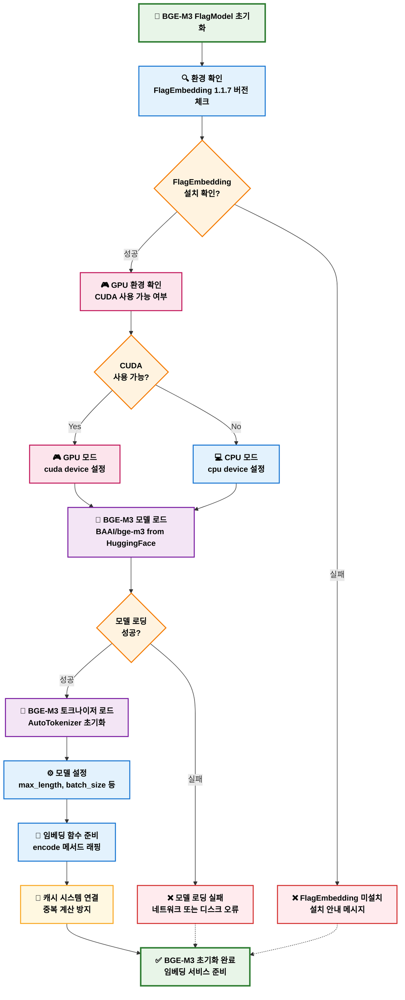
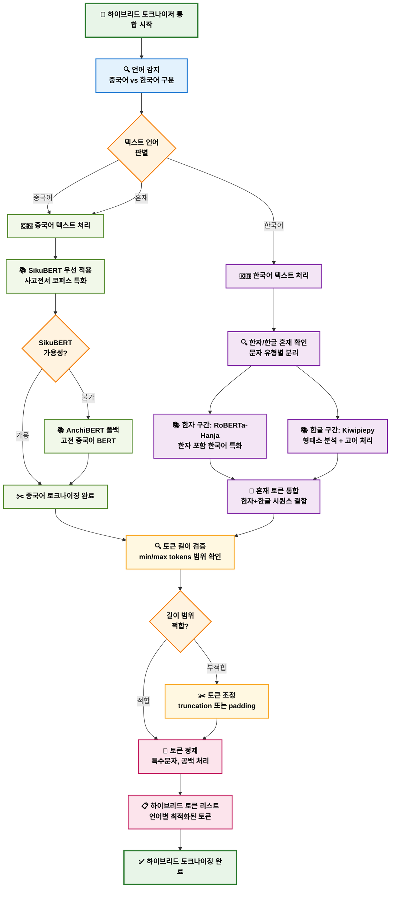
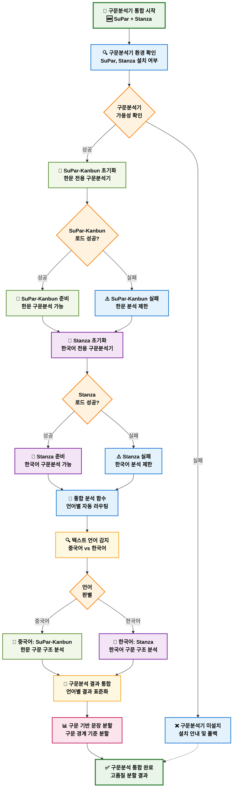
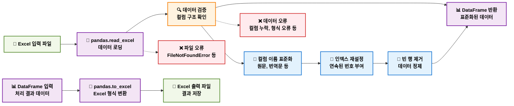
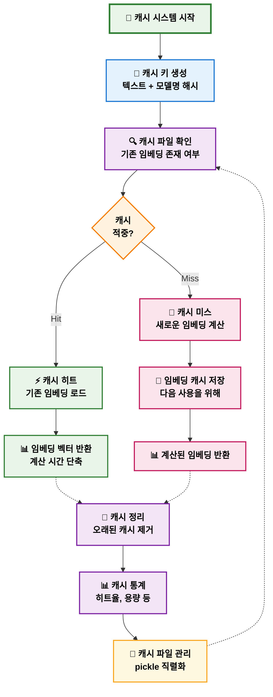

# Common 디렉토리 상세 플로우차트

## Common 모듈 구조 및 워크플로우 - 공통 라이브러리 (2025-08-21 최신)

---

## Common 디렉토리 전체 아키텍처 플로우차트

```mermaid
flowchart TB
    %% 스타일 정의
    classDef startEnd fill:#e8f5e8,stroke:#2e7d32,stroke-width:3px,color:#000,font-weight:bold
    classDef core fill:#e3f2fd,stroke:#1976d2,stroke-width:2px,color:#000,font-weight:bold
    classDef embedder fill:#f3e5f5,stroke:#7b1fa2,stroke-width:2px,color:#000,font-weight:bold
    classDef tokenizer fill:#fff3e0,stroke:#f57c00,stroke-width:2px,color:#000,font-weight:bold
    classDef parser fill:#f1f8e9,stroke:#558b2f,stroke-width:2px,color:#000,font-weight:bold
    classDef utility fill:#fce4ec,stroke:#c2185b,stroke-width:2px,color:#000,font-weight:bold
    classDef cache fill:#fff8e1,stroke:#f9a825,stroke-width:2px,color:#000,font-weight:bold
    
    A[🚀 Common 모듈 시작<br/>공통 기능 라이브러리]:::startEnd
    
    %% 임베더 모듈
    B[🧠 embedders/ 디렉토리<br/>임베딩 엔진 모음]:::embedder
    C[🤖 bge.py<br/>BGE-M3 FlagModel 래퍼<br/>안정화된 임베딩 엔진]:::embedder
    D[🌐 openai_embedder.py<br/>OpenAI API 래퍼<br/>text-embedding-3-large]:::embedder
    
    %% 토크나이저 모듈
    E[🏮 tokenizers/ 디렉토리<br/>하이브리드 토크나이저 모음]:::tokenizer
    F[📚 siku_bert.py<br/>SikuBERT 토크나이저<br/>사고전서 코퍼스 훈련]:::tokenizer
    G[📚 anchi_bert.py<br/>AnchiBERT 토크나이저<br/>고전 중국어 BERT]:::tokenizer
    H[📚 roberta_hanja.py<br/>RoBERTa-Hanja 토크나이저<br/>한자 포함 한국어]:::tokenizer
    I[📚 kiwipiepy_wrapper.py<br/>Kiwipiepy 래퍼<br/>한글 형태소 분석]:::tokenizer
    
    %% 구문분석기 모듈
    J[🏮 parsers/ 디렉토리<br/>🆕 구문분석기 모음]:::parser
    K[🏮 supar_kanbun.py<br/>🆕 SuPar-Kanbun 래퍼<br/>한문 구문분석기]:::parser
    L[🏮 stanza_korean.py<br/>🆕 Stanza 래퍼<br/>한국어 구문분석기]:::parser
    M[🏮 new_parsers.py<br/>🆕 통합 구문분석기<br/>SuPar + Stanza 연동]:::parser
    
    %% 유틸리티 모듈
    N[🔧 io_utils.py<br/>Excel 입출력 유틸리티<br/>pandas 래퍼]:::utility
    O[🏮 korean_particle_matcher.py<br/>한글 토씨 매칭<br/>Kiwipiepy 연동]:::utility
    P[📊 progress_manager.py<br/>진행률 관리<br/>tqdm + 로깅]:::utility
    
    %% 캐시 시스템
    Q[💾 cache/ 디렉토리<br/>임베딩 캐시 관리]:::cache
    R[💾 embedding_cache.py<br/>BGE-M3 캐시 관리<br/>pickle 기반 저장]:::cache
    S[💾 model_cache.py<br/>모델 캐시 관리<br/>transformers 캐시]:::cache
    
    A --> B
    A --> E
    A --> J
    A --> N
    A --> Q
    
    %% 임베더 관계
    B --> C
    B --> D
    
    %% 토크나이저 관계
    E --> F
    E --> G
    E --> H
    E --> I
    
    %% 구문분석기 관계
    J --> K
    J --> L
    J --> M
    
    %% 유틸리티 관계
    N --> O
    N --> P
    
    %% 캐시 관계
    Q --> R
    Q --> S
```

---

## BGE-M3 FlagModel 임베더 플로우차트

---

## 하이브리드 토크나이저 통합 플로우차트

---

## 구문분석기 통합 플로우차트

---

## IO 유틸리티 플로우차트

---

## 캐시 시스템 플로우차트

---

## Common 모듈 통합 테스트 플로우차트

```mermaid
flowchart TD
    %% 스타일 정의
    classDef startEnd fill:#e8f5e8,stroke:#2e7d32,stroke-width:3px,color:#000,font-weight:bold
    classDef test fill:#e3f2fd,stroke:#1976d2,stroke-width:2px,color:#000,font-weight:bold
    classDef success fill:#e8f5e8,stroke:#2e7d32,stroke-width:2px,color:#000,font-weight:bold
    classDef failure fill:#ffebee,stroke:#d32f2f,stroke-width:2px,color:#000,font-weight:bold
    classDef module fill:#f3e5f5,stroke:#7b1fa2,stroke-width:2px,color:#000,font-weight:bold
    
    A[🚀 Common 모듈 통합 테스트 시작]:::startEnd
    
    %% 임베더 테스트
    B[🧠 BGE-M3 임베더 테스트<br/>초기화 및 임베딩 수행]:::test
    C{BGE-M3<br/>테스트 통과?}:::test
    D[✅ BGE-M3 테스트 성공<br/>임베딩 품질 확인]:::success
    E[❌ BGE-M3 테스트 실패<br/>모델 로딩 또는 임베딩 오류]:::failure
    
    %% 토크나이저 테스트
    F[🏮 하이브리드 토크나이저 테스트<br/>중국어/한국어 토크나이징]:::test
    G{토크나이저<br/>테스트 통과?}:::test
    H[✅ 토크나이저 테스트 성공<br/>언어별 토큰 품질 확인]:::success
    I[❌ 토크나이저 테스트 실패<br/>모델 로딩 또는 토큰화 오류]:::failure
    
    %% 구문분석기 테스트
    J[🏮 구문분석기 테스트<br/>SuPar + Stanza 통합]:::test
    K{구문분석기<br/>테스트 통과?}:::test
    L[✅ 구문분석기 테스트 성공<br/>구문 분석 품질 확인]:::success
    M[❌ 구문분석기 테스트 실패<br/>모델 로딩 또는 분석 오류]:::failure
    
    %% IO 유틸리티 테스트
    N[🔧 IO 유틸리티 테스트<br/>Excel 읽기/쓰기]:::test
    O{IO 테스트<br/>통과?}:::test
    P[✅ IO 테스트 성공<br/>파일 처리 확인]:::success
    Q[❌ IO 테스트 실패<br/>파일 접근 또는 형식 오류]:::failure
    
    %% 캐시 시스템 테스트
    R[💾 캐시 시스템 테스트<br/>저장/로드 기능]:::test
    S{캐시 테스트<br/>통과?}:::test
    T[✅ 캐시 테스트 성공<br/>캐시 동작 확인]:::success
    U[❌ 캐시 테스트 실패<br/>파일 시스템 오류]:::failure
    
    %% 통합 테스트 결과
    V[📊 전체 테스트 결과<br/>성공/실패 통계]:::test
    W[✅ Common 모듈 준비 완료<br/>SA/PA 모듈에서 사용 가능]:::startEnd
    
    A --> B
    B --> C
    C -->|성공| D
    C -->|실패| E
    D --> F
    E --> F
    
    F --> G
    G -->|성공| H
    G -->|실패| I
    H --> J
    I --> J
    
    J --> K
    K -->|성공| L
    K -->|실패| M
    L --> N
    M --> N
    
    N --> O
    O -->|성공| P
    O -->|실패| Q
    P --> R
    Q --> R
    
    R --> S
    S -->|성공| T
    S -->|실패| U
    T --> V
    U --> V
    V --> W
```

이제 Common 디렉토리의 모든 구성 요소와 상세한 워크플로우를 시각화했습니다. 이를 통해 SA와 PA 모듈이 어떻게 공통 라이브러리를 활용하는지 명확하게 이해할 수 있습니다!
