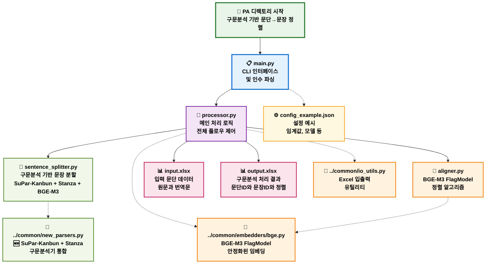
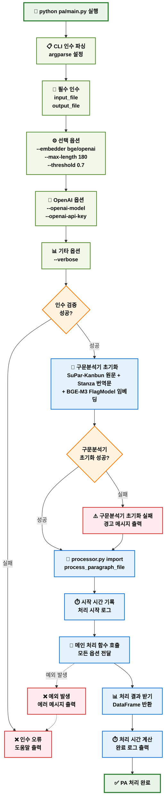
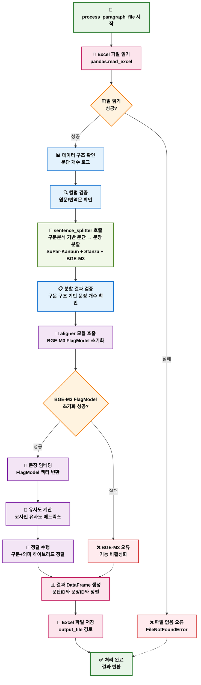
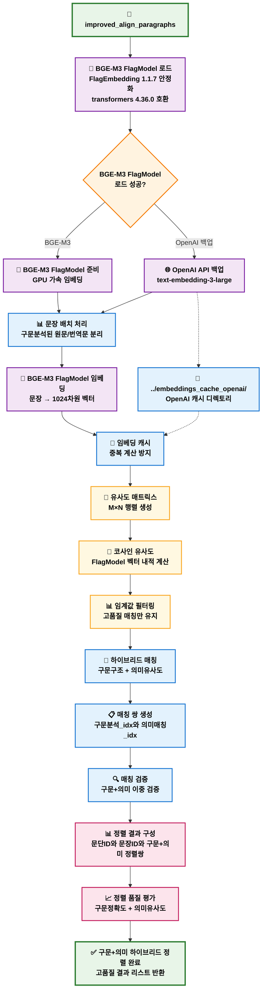
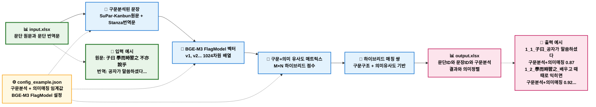

# PA 디렉토리 상세 플로우차트

## PA (Paragraph Aligner) 모듈 구조 및 워크플로우 - 구문분석 기반 (2025-08-21 최신)

---

## PA 디렉토리 전체 아키텍처 플로우차트

---

## PA main.py 실행 플로우차트

---

## PA processor.py 메인 처리 플로우차트

---

## PA sentence_splitter.py 분할 플로우차트

```mermaid
flowchart TD
    %% 스타일 정의
    classDef startEnd fill:#e8f5e8,stroke:#2e7d32,stroke-width:3px,color:#000,font-weight:bold
    classDef process fill:#e3f2fd,stroke:#1976d2,stroke-width:2px,color:#000,font-weight:bold
    classDef decision fill:#fff3e0,stroke:#f57c00,stroke-width:2px,color:#000,font-weight:bold
    classDef parser fill:#f1f8e9,stroke:#558b2f,stroke-width:2px,color:#000,font-weight:bold
    classDef embedder fill:#fff8e1,stroke:#f9a825,stroke-width:2px,color:#000,font-weight:bold
    classDef validation fill:#f1f8e9,stroke:#558b2f,stroke-width:2px,color:#000,font-weight:bold
    classDef output fill:#fce4ec,stroke:#c2185b,stroke-width:2px,color:#000,font-weight:bold
    
    A[🚀 split_target_sentences_advanced<br/>구문분석 기반 고급 분할]:::startEnd
    
    %% 🆕 구문분석기 초기화
    PA[🏮 구문분석기 초기화<br/>SuPar-Kanbun 원문 + Stanza 번역문]:::parser
    B[🤖 BGE-M3 FlagModel 로드<br/>의미적 매칭용 임베더]:::embedder
    C{구문분석기 로드<br/>성공?}:::decision
    D[❌ 구문분석기 없음<br/>설치 안내 출력]:::process
    
    %% 문단별 처리
    E[📋 문단 데이터 순회<br/>tqdm 진행률 표시]:::process
    F[📝 원문 문단 구문분석<br/>🆕 SuPar-Kanbun 한문 구문분석<br/>구문 구조 기반 정확 분할]:::parser
    G[📝 번역문 문단 구문분석<br/>🆕 Stanza 한국어 구문분석<br/>구문 구조 기반 정확 분할]:::parser
    
    %% BGE-M3 기반 의미적 정렬
    H[🧠 BGE-M3 FlagModel 임베딩<br/>구문 분할된 문장들의 의미 매칭]:::embedder
    I[🔍 분할 품질 검증<br/>구문+의미 이중 검증]:::validation
    J{구문분석+의미매칭<br/>품질 통과?}:::decision
    K[✂️ 보수적 재분할<br/>구문 구조 우선 재분석]:::validation
    
    %% 문장 검증
    L[🔍 문장 길이 검증<br/>max_length 기준]:::validation
    M{길이 기준<br/>통과?}:::decision
    N[✂️ 긴 문장 재분할<br/>구두점 기준]:::process
    
    %% 문장 정제
    O[🧹 문장 정제<br/>공백/특수문자 제거]:::process
    P[📊 빈 문장 필터링<br/>유효 문장만 유지]:::validation
    
    %% 결과 생성
    Q[📋 문장 리스트 생성<br/>구문분석 기반 정확한 문장쌍]:::output
    R[📊 분할 통계 출력<br/>구문 구조별 문장 개수]:::output
    S[✅ 구문분석 기반 분할 완료<br/>고품질 문장 리스트 반환]:::startEnd
    
    A --> PA
    PA --> B
    B --> C
    C -->|실패| D
    C -->|성공| E
    E --> F
    F --> G
    G --> H
    H --> I
    I --> J
    J -->|실패| K
    J -->|성공| L
    K --> L
    L --> M
    M -->|실패| N
    M -->|성공| O
    N --> O
    O --> P
    P --> Q
    Q --> R
    R --> S
    
    D -.-> S
```

---

## PA aligner.py 정렬 플로우차트

---

## PA 디렉토리 데이터 플로우

이제 PA 디렉토리의 모든 구성 요소와 데이터 플로우를 상세히 시각화했습니다. 다음으로 SA 디렉토리 플로우차트를 작성하겠습니다.
