# Accuracy 디렉토리 상세 플로우차트

## Accuracy 모듈 구조 및 워크플로우 - 정확도 평가 시스템 (2025-08-21 최신)

---

## Accuracy 디렉토리 전체 아키텍처 플로우차트

```mermaid
flowchart TB
    %% 스타일 정의
    classDef startEnd fill:#e8f5e8,stroke:#2e7d32,stroke-width:3px,color:#000,font-weight:bold
    classDef core fill:#e3f2fd,stroke:#1976d2,stroke-width:2px,color:#000,font-weight:bold
    classDef evaluator fill:#f3e5f5,stroke:#7b1fa2,stroke-width:2px,color:#000,font-weight:bold
    classDef analyzer fill:#fff3e0,stroke:#f57c00,stroke-width:2px,color:#000,font-weight:bold
    classDef data fill:#fce4ec,stroke:#c2185b,stroke-width:2px,color:#000,font-weight:bold
    classDef report fill:#fff8e1,stroke:#f9a825,stroke-width:2px,color:#000,font-weight:bold
    classDef guide fill:#f1f8e9,stroke:#558b2f,stroke-width:2px,color:#000,font-weight:bold
    
    A[🚀 Accuracy 디렉토리 시작<br/>정확도 평가 시스템]:::startEnd
    
    %% 핵심 평가기들
    B[🔧 accuracy_evaluator.py<br/>전체 정확도 평가 엔진<br/>Precision, Recall, F1]:::core
    C[🔧 row_pair_evaluator.py<br/>행별 쌍 매칭 평가<br/>1:1, 1:N, N:1 분석]:::evaluator
    
    %% 텍스트 손실 분석기들
    D[🔍 analyze_text_loss.py<br/>일반 텍스트 손실 분석<br/>누락 텍스트 검출]:::analyzer
    E[🔍 analyze_sa_text_loss.py<br/>SA 전용 텍스트 손실 분석<br/>구별 매칭 손실 추적]:::analyzer
    
    %% 평가 데이터 파일들
    F[📊 관자1_구병렬.xlsx<br/>관자 1권 구 단위 병렬 데이터<br/>정답 라벨링]:::data
    G[📊 관자3_문장병렬.xlsx<br/>관자 3권 문장 단위 병렬 데이터<br/>정답 라벨링]:::data
    
    %% 시스템 출력 데이터
    H[📊 output_pa.xlsx<br/>PA 모듈 처리 결과<br/>문단→문장 정렬]:::data
    I[📊 output.xlsx<br/>SA 모듈 처리 결과<br/>문장→구 정렬]:::data
    
    %% 평가 결과 보고서들
    J[📄 accuracy_results_improved.xlsx<br/>종합 정확도 평가 결과<br/>상세 메트릭 포함]:::report
    K[📄 row_pair_results.xlsx<br/>행별 매칭 평가 결과<br/>쌍별 분석 상세]:::report
    
    %% 문서화 및 가이드
    L[📋 COMPREHENSIVE_GUIDE.md<br/>정확도 평가 종합 가이드<br/>메트릭 설명 및 해석]:::guide
    M[📋 evaluation_guide.md<br/>평가 방법론 가이드<br/>평가 절차 및 기준]:::guide
    N[📋 README_accuracy.md<br/>Accuracy 모듈 사용법<br/>빠른 시작 가이드]:::guide
    
    A --> B
    A --> C
    A --> D
    A --> E
    
    %% 데이터 입력 관계
    B --> F
    B --> G
    B --> H
    B --> I
    
    C --> F
    C --> G
    
    D --> H
    D --> I
    E --> I
    
    %% 결과 출력 관계
    B --> J
    C --> K
    D --> J
    E --> J
    
    %% 문서화 관계
    A -.-> L
    A -.-> M
    A -.-> N
```

---

## 전체 정확도 평가 플로우차트

```mermaid
flowchart TD
    %% 스타일 정의
    classDef startEnd fill:#e8f5e8,stroke:#2e7d32,stroke-width:3px,color:#000,font-weight:bold
    classDef process fill:#e3f2fd,stroke:#1976d2,stroke-width:2px,color:#000,font-weight:bold
    classDef decision fill:#fff3e0,stroke:#f57c00,stroke-width:2px,color:#000,font-weight:bold
    classDef metrics fill:#f3e5f5,stroke:#7b1fa2,stroke-width:2px,color:#000,font-weight:bold
    classDef data fill:#fce4ec,stroke:#c2185b,stroke-width:2px,color:#000,font-weight:bold
    classDef analysis fill:#fff8e1,stroke:#f9a825,stroke-width:2px,color:#000,font-weight:bold
    classDef report fill:#f1f8e9,stroke:#558b2f,stroke-width:2px,color:#000,font-weight:bold
    
    A[🚀 accuracy_evaluator.py 실행]:::startEnd
    
    %% 데이터 로딩
    B[📂 정답 데이터 로딩<br/>관자1_구병렬.xlsx<br/>관자3_문장병렬.xlsx]:::data
    C[📂 시스템 출력 로딩<br/>PA: output_pa.xlsx<br/>SA: output.xlsx]:::data
    D[🔍 데이터 형식 검증<br/>컬럼 구조 및 인덱스 확인]:::process
    
    %% 데이터 전처리
    E[🧹 데이터 정제<br/>공백 제거, 정규화]:::process
    F[🔗 데이터 매칭<br/>정답과 시스템 출력 대응]:::process
    G{매칭<br/>성공?}:::decision
    H[⚠️ 매칭 실패<br/>데이터 불일치 보고]:::process
    
    %% 핵심 메트릭 계산
    I[📊 Precision 계산<br/>정확히 맞춘 비율]:::metrics
    J[📊 Recall 계산<br/>찾아낸 정답 비율]:::metrics
    K[📊 F1 Score 계산<br/>Precision과 Recall 조화평균]:::metrics
    
    %% 상세 분석
    L[🔍 매칭 유형 분석<br/>1:1, 1:N, N:1, N:M 분류]:::analysis
    M[🔍 오류 유형 분석<br/>누락, 추가, 잘못된 매칭]:::analysis
    N[🔍 텍스트 손실 분석<br/>원문 보존률 계산]:::analysis
    
    %% 품질 평가
    O[📈 품질 점수 산출<br/>종합 품질 지수]:::metrics
    P[🎯 임계값 비교<br/>허용 가능한 품질 기준]:::process
    Q{품질 기준<br/>통과?}:::decision
    
    %% 결과 생성
    R[📄 상세 보고서 생성<br/>accuracy_results_improved.xlsx]:::report
    S[📊 요약 통계<br/>주요 메트릭 요약]:::report
    T[📋 개선 권장사항<br/>품질 향상 제안]:::report
    U[✅ 정확도 평가 완료]:::startEnd
    
    A --> B
    B --> C
    C --> D
    D --> E
    E --> F
    F --> G
    G -->|성공| I
    G -->|실패| H
    H --> I
    
    I --> J
    J --> K
    K --> L
    L --> M
    M --> N
    N --> O
    O --> P
    P --> Q
    Q -->|통과| R
    Q -->|실패| T
    
    R --> S
    S --> U
    T --> U
```

---

## 행별 쌍 매칭 평가 플로우차트

```mermaid
flowchart TD
    %% 스타일 정의
    classDef startEnd fill:#e8f5e8,stroke:#2e7d32,stroke-width:3px,color:#000,font-weight:bold
    classDef process fill:#e3f2fd,stroke:#1976d2,stroke-width:2px,color:#000,font-weight:bold
    classDef decision fill:#fff3e0,stroke:#f57c00,stroke-width:2px,color:#000,font-weight:bold
    classDef matching fill:#f3e5f5,stroke:#7b1fa2,stroke-width:2px,color:#000,font-weight:bold
    classDef analysis fill:#fff8e1,stroke:#f9a825,stroke-width:2px,color:#000,font-weight:bold
    classDef data fill:#fce4ec,stroke:#c2185b,stroke-width:2px,color:#000,font-weight:bold
    classDef result fill:#f1f8e9,stroke:#558b2f,stroke-width:2px,color:#000,font-weight:bold
    
    A[🚀 row_pair_evaluator.py 실행]:::startEnd
    
    %% 데이터 준비
    B[📂 행별 데이터 로딩<br/>정답과 시스템 출력]:::data
    C[🔍 행 단위 인덱싱<br/>각 행에 고유 ID 부여]:::process
    D[📋 쌍 매칭 후보 생성<br/>가능한 모든 조합]:::process
    
    %% 매칭 유형 분류
    E[🔍 1:1 매칭 탐지<br/>완전한 일대일 대응]:::matching
    F[🔍 1:N 매칭 탐지<br/>하나가 여러 개와 대응]:::matching
    G[🔍 N:1 매칭 탐지<br/>여러 개가 하나와 대응]:::matching
    H[🔍 N:M 매칭 탐지<br/>복합적 다대다 대응]:::matching
    
    %% 매칭 품질 분석
    I[📊 유사도 점수 계산<br/>텍스트 유사성 측정]:::analysis
    J[📊 길이 비율 분석<br/>원문과 번역문 길이 비교]:::analysis
    K[📊 위치 일관성 분석<br/>순서 보존 여부 확인]:::analysis
    
    %% 오류 분석
    L{매칭 오류<br/>감지?}:::decision
    M[🔍 누락된 쌍 분석<br/>매칭되지 않은 항목]:::analysis
    N[🔍 잘못된 쌍 분석<br/>부정확한 매칭]:::analysis
    O[🔍 중복 매칭 분석<br/>하나가 여러 번 매칭]:::analysis
    
    %% 통계 계산
    P[📊 매칭 유형별 통계<br/>각 유형의 개수와 비율]:::result
    Q[📊 품질 분포 분석<br/>유사도 점수 분포]:::result
    R[📊 오류율 계산<br/>전체 대비 오류 비율]:::result
    
    %% 결과 출력
    S[📄 행별 평가 결과<br/>row_pair_results.xlsx]:::result
    T[📊 매칭 매트릭스<br/>시각적 매칭 현황]:::result
    U[📋 개선 포인트<br/>매칭 품질 향상 방안]:::result
    V[✅ 행별 평가 완료]:::startEnd
    
    A --> B
    B --> C
    C --> D
    D --> E
    E --> F
    F --> G
    G --> H
    H --> I
    I --> J
    J --> K
    K --> L
    L -->|발견| M
    L -->|정상| P
    M --> N
    N --> O
    O --> P
    P --> Q
    Q --> R
    R --> S
    S --> T
    T --> U
    U --> V
```

---

## 텍스트 손실 분석 플로우차트

```mermaid
flowchart TD
    %% 스타일 정의
    classDef startEnd fill:#e8f5e8,stroke:#2e7d32,stroke-width:3px,color:#000,font-weight:bold
    classDef process fill:#e3f2fd,stroke:#1976d2,stroke-width:2px,color:#000,font-weight:bold
    classDef decision fill:#fff3e0,stroke:#f57c00,stroke-width:2px,color:#000,font-weight:bold
    classDef analysis fill:#f3e5f5,stroke:#7b1fa2,stroke-width:2px,color:#000,font-weight:bold
    classDef detection fill:#fff8e1,stroke:#f9a825,stroke-width:2px,color:#000,font-weight:bold
    classDef data fill:#fce4ec,stroke:#c2185b,stroke-width:2px,color:#000,font-weight:bold
    classDef report fill:#f1f8e9,stroke:#558b2f,stroke-width:2px,color:#000,font-weight:bold
    
    A[🚀 텍스트 손실 분석 시작<br/>analyze_text_loss.py]:::startEnd
    
    %% 원본 텍스트 분석
    B[📝 원본 텍스트 추출<br/>입력 데이터의 모든 텍스트]:::data
    C[📝 처리 결과 텍스트 추출<br/>시스템 출력의 모든 텍스트]:::data
    D[🔍 텍스트 정규화<br/>공백, 특수문자 통일]:::process
    
    %% 문자 단위 분석
    E[🔤 문자 단위 비교<br/>개별 문자 매칭]:::analysis
    F[📊 문자 보존율 계산<br/>원본 대비 보존된 문자 비율]:::analysis
    G{문자 손실<br/>감지?}:::decision
    H[🔍 손실 문자 추출<br/>누락된 문자들 식별]:::detection
    
    %% 단어 단위 분석
    I[🔤 단어 단위 비교<br/>토큰 레벨 매칭]:::analysis
    J[📊 단어 보존율 계산<br/>원본 대비 보존된 단어 비율]:::analysis
    K{단어 손실<br/>감지?}:::decision
    L[🔍 손실 단어 추출<br/>누락된 단어들 식별]:::detection
    
    %% 문장 단위 분석
    M[📝 문장 단위 비교<br/>문장 레벨 매칭]:::analysis
    N[📊 문장 보존율 계산<br/>원본 대비 보존된 문장 비율]:::analysis
    O{문장 손실<br/>감지?}:::decision
    P[🔍 손실 문장 추출<br/>누락된 문장들 식별]:::detection
    
    %% 의미적 손실 분석
    Q[🧠 의미적 완성도 분석<br/>내용 보존 정도 평가]:::analysis
    R[📊 정보 손실율 계산<br/>핵심 정보 누락 정도]:::analysis
    
    %% 손실 패턴 분석
    S[🔍 손실 패턴 분석<br/>어떤 유형이 주로 손실되는가]:::analysis
    T[📊 손실 위치 분석<br/>문서 내 손실 발생 위치]:::analysis
    U[📊 손실 원인 분석<br/>처리 단계별 손실 추적]:::analysis
    
    %% 결과 보고
    V[📄 손실 분석 보고서<br/>상세 손실 현황]:::report
    W[📊 손실 통계<br/>레벨별 손실율]:::report
    X[📋 개선 제안<br/>손실 최소화 방안]:::report
    Y[✅ 텍스트 손실 분석 완료]:::startEnd
    
    A --> B
    B --> C
    C --> D
    D --> E
    E --> F
    F --> G
    G -->|예| H
    G -->|아니오| I
    H --> I
    
    I --> J
    J --> K
    K -->|예| L
    K -->|아니오| M
    L --> M
    
    M --> N
    N --> O
    O -->|예| P
    O -->|아니오| Q
    P --> Q
    
    Q --> R
    R --> S
    S --> T
    T --> U
    U --> V
    V --> W
    W --> X
    X --> Y
```

---

## SA 전용 텍스트 손실 분석 플로우차트

```mermaid
flowchart TD
    %% 스타일 정의
    classDef startEnd fill:#e8f5e8,stroke:#2e7d32,stroke-width:3px,color:#000,font-weight:bold
    classDef process fill:#e3f2fd,stroke:#1976d2,stroke-width:2px,color:#000,font-weight:bold
    classDef decision fill:#fff3e0,stroke:#f57c00,stroke-width:2px,color:#000,font-weight:bold
    classDef sa_specific fill:#f3e5f5,stroke:#7b1fa2,stroke-width:2px,color:#000,font-weight:bold
    classDef integrity fill:#fff8e1,stroke:#f9a825,stroke-width:2px,color:#000,font-weight:bold
    classDef phrase fill:#fce4ec,stroke:#c2185b,stroke-width:2px,color:#000,font-weight:bold
    classDef report fill:#f1f8e9,stroke:#558b2f,stroke-width:2px,color:#000,font-weight:bold
    
    A[🚀 SA 전용 손실 분석 시작<br/>analyze_sa_text_loss.py]:::startEnd
    
    %% SA 특화 데이터 로딩
    B[📊 SA 입력 데이터<br/>문장 단위 원문과 번역문]:::sa_specific
    C[📊 SA 출력 데이터<br/>구별 정렬 결과]:::sa_specific
    D[🔍 SA 무결성 로그<br/>처리 과정 추적 정보]:::integrity
    
    %% 구별 손실 분석
    E[📝 원문 구 추출<br/>SA 입력의 모든 구]:::phrase
    F[📝 결과 구 추출<br/>SA 출력의 모든 구]:::phrase
    G[🔍 구별 매칭 분석<br/>입력 구와 출력 구 대응]:::sa_specific
    
    %% 무결성 검증
    H[🛡️ 순서 무결성 확인<br/>구의 순서 보존 여부]:::integrity
    I{순서<br/>보존?}:::decision
    J[⚠️ 순서 변경 감지<br/>위치 이동된 구들]:::integrity
    
    %% 구두점 손실 분석
    K[🎭 구두점 보존 확인<br/>마스킹/복원 과정 검증]:::integrity
    L{구두점<br/>보존?}:::decision
    M[⚠️ 구두점 손실 감지<br/>누락된 구두점들]:::integrity
    
    %% 토크나이징 손실 분석
    N[🏮 토크나이징 품질 확인<br/>하이브리드 토크나이저 결과]:::sa_specific
    O[📊 토큰 보존율 계산<br/>원본 대비 토큰 유지율]:::sa_specific
    P{토큰 손실<br/>감지?}:::decision
    Q[🔍 토큰 손실 분석<br/>어떤 토큰이 손실되었는가]:::sa_specific
    
    %% 임베딩 손실 분석
    R[🧠 임베딩 품질 확인<br/>BGE-M3 벡터 품질]:::sa_specific
    S[📊 의미 보존 분석<br/>임베딩 유사도 변화]:::sa_specific
    T{의미 손실<br/>감지?}:::decision
    U[🔍 의미 손실 분석<br/>임베딩 품질 저하 원인]:::sa_specific
    
    %% 정렬 손실 분석
    V[🎯 정렬 품질 확인<br/>원문-번역문 매칭 정확도]:::sa_specific
    W[📊 매칭 손실율 계산<br/>정렬되지 않은 구의 비율]:::sa_specific
    X{매칭 손실<br/>감지?}:::decision
    Y[🔍 매칭 실패 분석<br/>정렬되지 않은 구들]:::sa_specific
    
    %% SA 종합 손실 보고서
    Z[📄 SA 손실 종합 보고서<br/>모든 단계별 손실 현황]:::report
    AA[📊 SA 품질 지표<br/>무결성, 완성도, 정확도]:::report
    BB[📋 SA 개선 방안<br/>손실 최소화 전략]:::report
    CC[✅ SA 손실 분석 완료]:::startEnd
    
    A --> B
    B --> C
    C --> D
    D --> E
    E --> F
    F --> G
    G --> H
    H --> I
    I -->|예| K
    I -->|아니오| J
    J --> K
    
    K --> L
    L -->|예| N
    L -->|아니오| M
    M --> N
    
    N --> O
    O --> P
    P -->|예| Q
    P -->|아니오| R
    Q --> R
    
    R --> S
    S --> T
    T -->|예| U
    T -->|아니오| V
    U --> V
    
    V --> W
    W --> X
    X -->|예| Y
    X -->|아니오| Z
    Y --> Z
    
    Z --> AA
    AA --> BB
    BB --> CC
```

---

## 정확도 평가 통합 리포트 플로우차트

```mermaid
flowchart LR
    %% 스타일 정의
    classDef input fill:#e8f5e8,stroke:#2e7d32,stroke-width:3px,color:#000,font-weight:bold
    classDef process fill:#e3f2fd,stroke:#1976d2,stroke-width:2px,color:#000,font-weight:bold
    classDef analysis fill:#f3e5f5,stroke:#7b1fa2,stroke-width:2px,color:#000,font-weight:bold
    classDef output fill:#fce4ec,stroke:#c2185b,stroke-width:2px,color:#000,font-weight:bold
    classDef report fill:#fff8e1,stroke:#f9a825,stroke-width:2px,color:#000,font-weight:bold
    classDef decision fill:#fff3e0,stroke:#f57c00,stroke-width:2px,color:#000,font-weight:bold
    
    %% 입력 소스들
    A[📊 accuracy_evaluator 결과<br/>전체 정확도 메트릭]:::input
    B[📊 row_pair_evaluator 결과<br/>행별 매칭 분석]:::input
    C[📊 text_loss_analyzer 결과<br/>텍스트 손실 분석]:::input
    
    %% 데이터 통합
    D[🔧 결과 데이터 통합<br/>모든 평가 결과 병합]:::process
    E[📊 메트릭 정규화<br/>서로 다른 척도 통일]:::process
    F[🔍 일관성 검증<br/>평가 결과 간 일치성 확인]:::analysis
    
    %% 종합 분석
    G[📈 종합 점수 계산<br/>가중 평균 기반 총점]:::analysis
    H[📊 강점/약점 분석<br/>모듈별 성능 비교]:::analysis
    I[📊 트렌드 분석<br/>시간에 따른 성능 변화]:::analysis
    
    %% 품질 등급
    J{종합 품질<br/>등급}:::decision
    K[🏆 우수 90점 이상<br/>운영 준비 완료]:::output
    L[👍 양호 80-90점<br/>미세 조정 필요]:::output
    M[⚠️ 보통 70-80점<br/>개선 작업 필요]:::output
    N[❌ 개선필요 70점 미만<br/>대폭 수정 필요]:::output
    
    %% 최종 보고서
    O[📄 종합 평가 보고서<br/>Executive Summary]:::report
    P[📊 상세 메트릭 리포트<br/>Technical Details]:::report
    Q[📋 개선 로드맵<br/>Action Items]:::report
    R[📈 벤치마크 비교<br/>타 시스템 대비 성능]:::report
    
    A --> D
    B --> D
    C --> D
    D --> E
    E --> F
    F --> G
    G --> H
    H --> I
    I --> J
    J --> K
    J --> L
    J --> M
    J --> N
    K --> O
    L --> O
    M --> O
    N --> O
    O --> P
    P --> Q
    Q --> R
```

이제 Accuracy 디렉토리의 모든 구성 요소와 상세한 평가 워크플로우를 시각화했습니다. 이를 통해 CSP 시스템의 품질을 종합적으로 평가하고 개선할 수 있는 체계적인 방법론을 제공합니다!
