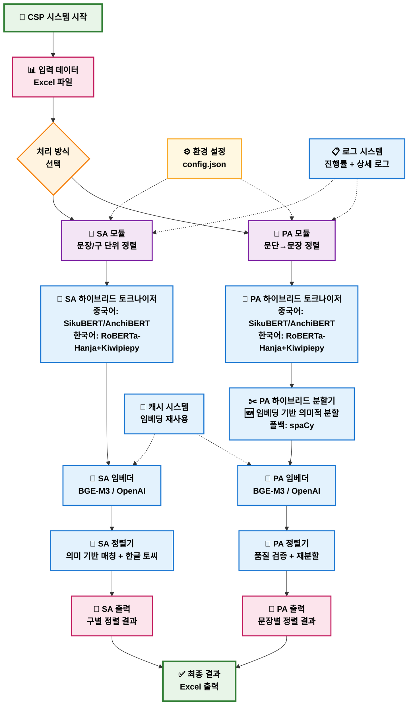
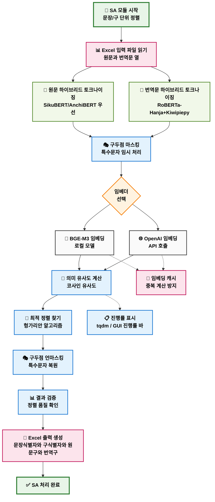
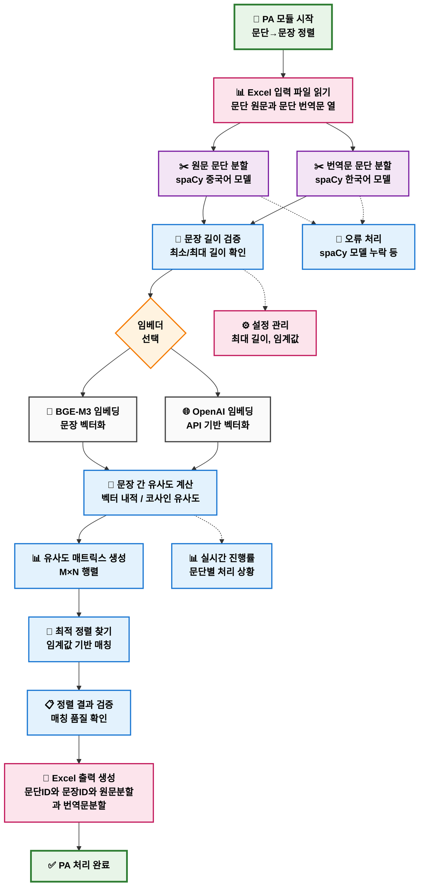
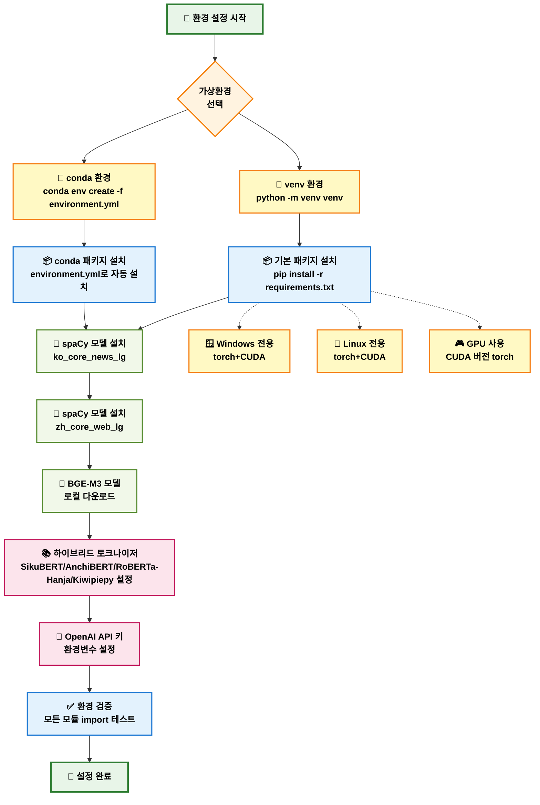
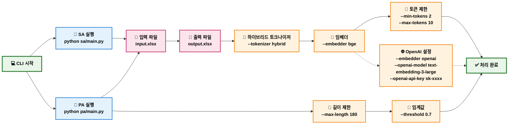

# CSP 프로젝트 전체 워크플로우 (2025-08-18 하이브리드 토크나이저 통합)

## 프로젝트 개요
CSP(Chinese-Korean Sentence Pairing)는 한문-한국어 번역 텍스트의 자동 정렬 시스템입니다. SA(문장/구 정렬)와 PA(문단→문장 정렬) 두 가지 모듈로 구성되어 있으며, **하이브리드 토크나이저 시스템**을 공통으로 사용합니다.

**🆕 2025-08-18 주요 업데이트:**
- **하이브리드 토크나이저 통합**: 중국어(SikuBERT/AnchiBERT) + 한국어(RoBERTa-Hanja+Kiwipiepy)
- **공통 모듈 아키텍처**: `common/tokenizers/` 디렉토리로 SA/PA 통합
- **Kiwipiepy 직접 연동**: `common/korean_particle_matcher.py`로 고성능 한글 분석
- **일관된 출력 형식**: SA/PA 모두 동일한 토크나이저 초기화 메시지

---

## 전체 시스템 아키텍처 플로우차트

---

## SA 모듈 상세 워크플로우

---

## PA 모듈 상세 워크플로우

---

## 환경 설정 및 의존성 플로우차트

---

## CLI 사용법 플로우차트

---

## 주요 특징

### ✨ 핵심 기능
- **SA 모듈**: 문장/구 단위 정밀 정렬 (하이브리드 토크나이저)
- **PA 모듈**: 문단→문장 분할 및 정렬 (하이브리드 토크나이저 + spaCy)
- **다중 임베더**: BGE-M3 (로컬) + OpenAI (API) 지원
- **실시간 모니터링**: CLI tqdm + GUI 진행률 바
- **캐시 시스템**: 임베딩 결과 재사용으로 성능 최적화

### 🔧 기술 스택
- **토크나이저**: SikuBERT/AnchiBERT (중국어), RoBERTa-Hanja+Kiwipiepy (한국어)
- **문장 분할**: spaCy (ko_core_news_lg, zh_core_web_lg) + 하이브리드 토크나이저
- **임베딩**: BGE-M3, OpenAI text-embedding-3-large
- **정렬 알고리즘**: 헝가리안 알고리즘, 임계값 기반 매칭
- **입출력**: Excel (xlsx) 파일 지원

### 📊 처리 성능
- **대용량 처리**: 수천 문장 단위 배치 처리
- **고품질 정렬**: 의미 기반 유사도 매칭
- **환경 최적화**: venv/conda 환경별 최적화
- **멀티플랫폼**: Windows/Linux/WSL 지원

### 🚀 사용 시나리오
- **학술 연구**: 한문 고전 번역 정렬
- **대용량 코퍼스**: 병렬 말뭉치 구축
- **번역 품질 평가**: 원문-번역문 대응 분석
- **자동화 파이프라인**: CLI 기반 배치 처리
