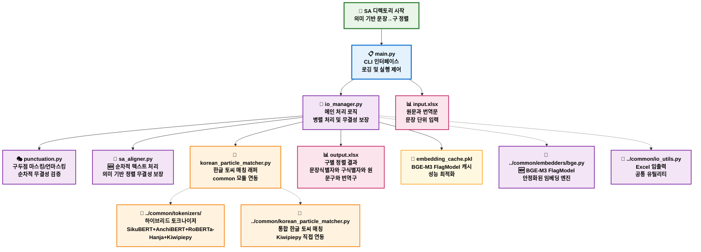
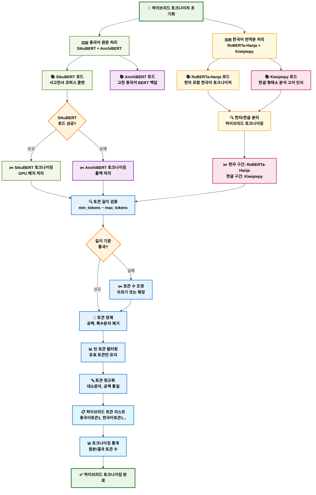
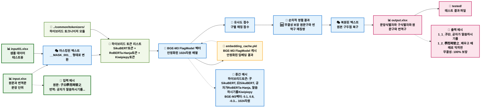
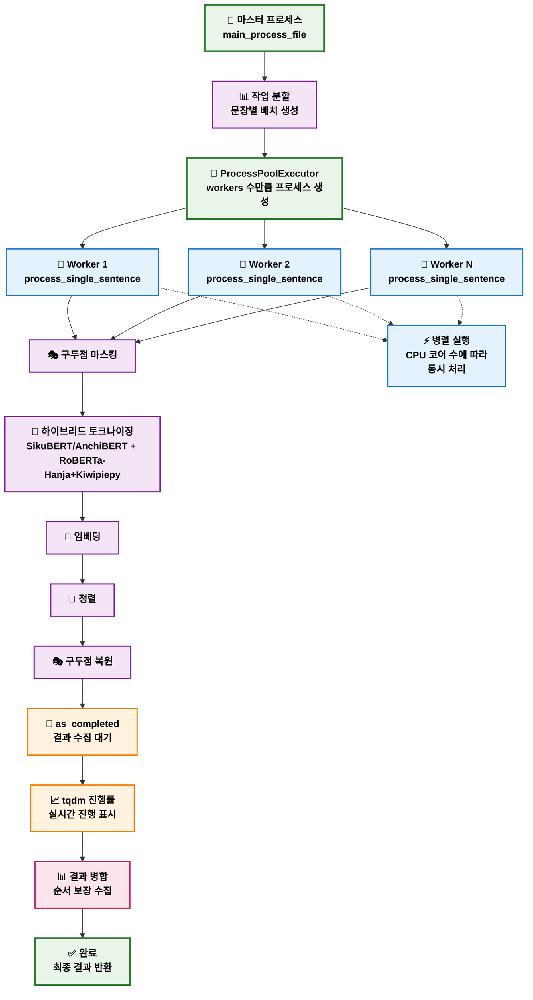

# SA 디렉토리 상세 플로우차트

## SA (Sentence Aligner) 모듈 구조 및 워크플로우 - 의미 기반 (2025-08-21 최신)

---

## SA 디렉토리 전체 아키텍처 플로우차트

---

## SA main.py 실행 플로우차트

```mermaid
flowchart TD
    %% 스타일 정의
    classDef startEnd fill:#e8f5e8,stroke:#2e7d32,stroke-width:3px,color:#000,font-weight:bold
    classDef process fill:#e3f2fd,stroke:#1976d2,stroke-width:2px,color:#000,font-weight:bold
    classDef decision fill:#fff3e0,stroke:#f57c00,stroke-width:2px,color:#000,font-weight:bold
    classDef cli fill:#f1f8e9,stroke:#558b2f,stroke-width:2px,color:#000,font-weight:bold
    classDef logging fill:#fff8e1,stroke:#f9a825,stroke-width:2px,color:#000,font-weight:bold
    classDef error fill:#ffebee,stroke:#d32f2f,stroke-width:2px,color:#000,font-weight:bold
    
    A[🚀 python sa/main.py 실행]:::startEnd
    
    %% 로깅 설정
    B[📋 setup_logging<br/>로깅 레벨 설정]:::logging
    C{--verbose<br/>옵션?}:::decision
    D[🔍 DEBUG 로깅<br/>상세 정보 출력]:::logging
    E[⚠️ WARNING 로깅<br/>필수 정보만 출력]:::logging
    
    %% 외부 라이브러리 조용히 설정
    F[🔇 외부 라이브러리 조용히<br/>transformers, datasets, torch<br/>경고 메시지 숨김]:::logging
    
    %% CLI 인수 파싱
    G[📋 CLI 인수 파싱<br/>argparse 설정]:::cli
    H[📄 필수 인수<br/>input_excel<br/>output_excel]:::cli
    I[⚙️ 선택 옵션<br/>--tokenizer hybrid<br/>--embedder bge/openai<br/>--min-tokens/--max-tokens]:::cli
    J[🔑 OpenAI 설정<br/>--openai-model<br/>--openai-api-key]:::cli
    K[🚀 성능 옵션<br/>--parallel<br/>--workers]:::cli
    
    %% 검증 및 실행
    L{인수 검증<br/>성공?}:::decision
    M[❌ 인수 오류<br/>도움말 출력]:::error
    
    %% 메인 처리 호출
    N[🔧 io_manager import<br/>process_file]:::process
    O[⏱️ 시작 시간 기록<br/>처리 시작 로그]:::process
    
    %% 🆕 하이브리드 토크나이저 초기화  
    HT[🏮 하이브리드 토크나이저 초기화<br/>SikuBERT+AnchiBERT+RoBERTa-Hanja+Kiwipiepy<br/>+ BGE-M3 FlagModel]:::process
    HT2{토크나이저<br/>초기화 성공?}:::decision
    HT3[⚠️ 토크나이저 초기화 실패<br/>경고 메시지 출력]:::error
    
    P[🎯 메인 처리 함수 호출<br/>모든 옵션 전달]:::process
    
    %% 결과 처리
    Q[📊 처리 결과 분석<br/>성공/실패 통계]:::process
    R[⏱️ 처리 시간 계산<br/>완료 로그 출력]:::process
    S[✅ SA 처리 완료]:::startEnd
    
    %% 오류 처리
    T[❌ 예외 발생<br/>상세 오류 로그]:::error
    
    A --> B
    B --> C
    C -->|True| D
    C -->|False| E
    D --> F
    E --> F
    F --> G
    G --> H
    H --> I
    I --> J
    J --> K
    K --> L
    L -->|실패| M
    L -->|성공| N
    N --> O
    O --> HT
    HT --> HT2
    HT2 -->|실패| HT3
    HT2 -->|성공| P
    HT3 --> P
    P --> Q
    Q --> R
    R --> S
    
    P -.->|예외 발생| T
    T -.-> M
```

---

## SA io_manager.py 메인 처리 플로우차트

```mermaid
flowchart TD
    %% 스타일 정의
    classDef startEnd fill:#e8f5e8,stroke:#2e7d32,stroke-width:3px,color:#000,font-weight:bold
    classDef process fill:#e3f2fd,stroke:#1976d2,stroke-width:2px,color:#000,font-weight:bold
    classDef decision fill:#fff3e0,stroke:#f57c00,stroke-width:2px,color:#000,font-weight:bold
    classDef parallel fill:#f3e5f5,stroke:#7b1fa2,stroke-width:2px,color:#000,font-weight:bold
    classDef integrity fill:#fff8e1,stroke:#f9a825,stroke-width:2px,color:#000,font-weight:bold
    classDef data fill:#fce4ec,stroke:#c2185b,stroke-width:2px,color:#000,font-weight:bold
    classDef error fill:#ffebee,stroke:#d32f2f,stroke-width:2px,color:#000,font-weight:bold
    
    A[🚀 main_process_file 시작]:::startEnd
    
    %% 입력 검증
    B[📂 Excel 파일 읽기<br/>pandas.read_excel]:::data
    C{파일 및 데이터<br/>검증 성공?}:::decision
    D[❌ 파일/데이터 오류<br/>에러 메시지 출력]:::error
    
    %% 무결성 모듈 초기화
    E[🎭 무결성 모듈 초기화<br/>punctuation.py import]:::integrity
    F[🔍 무결성 상태 확인<br/>get_integrity_status 함수]:::integrity
    
    %% 병렬 처리 설정
    G{병렬 처리<br/>옵션?}:::decision
    H[🚀 ProcessPoolExecutor<br/>workers 수 설정]:::parallel
    I[📋 단일 스레드 처리<br/>순차 실행]:::process
    
    %% 문장별 처리 (병렬)
    J[📊 문장 데이터 분할<br/>배치 단위로 분할]:::parallel
    K[🔄 병렬 작업 스케줄링<br/>as_completed 사용]:::parallel
    L[📈 실시간 진행률<br/>tqdm 진행률 바]:::parallel
    
    %% 개별 문장 처리
    M[🎯 문장별 처리 함수<br/>process_single_sentence]:::process
    N[🎭 구두점 마스킹<br/>safe_mask_brackets]:::integrity
    O[🏮 하이브리드 토크나이징<br/>SikuBERT/AnchiBERT + RoBERTa-Hanja+Kiwipiepy]:::process
    P[🧠 BGE-M3 FlagModel 임베딩<br/>안정화된 1024차원 벡터]:::process
    Q[📐 순차적 정렬 수행<br/>🆕 무결성 보장 텍스트 처리]:::process
    R[🎭 구두점 복원<br/>safe_restore_brackets]:::integrity
    
    %% 결과 수집 및 검증
    S[📊 결과 수집<br/>병렬 작업 결과 병합]:::process
    T[🔍 순차적 무결성 검증<br/>🆕 단어 순서 보장 확인]:::integrity
    U{무결성<br/>통과?}:::decision
    V[⚠️ 무결성 경고<br/>위치 변화 없음 확인]:::error
    
    %% 최종 출력
    W[📄 Excel 출력<br/>구별 정렬 결과 저장]:::data
    X[💾 BGE-M3 FlagModel 캐시 업데이트<br/>안정화된 임베딩 캐시 저장]:::data
    Y[✅ 의미 기반 SA 처리 완료<br/>무결성 보장 통계 정보 출력]:::startEnd
    
    A --> B
    B --> C
    C -->|실패| D
    C -->|성공| E
    E --> F
    F --> G
    G -->|True| H
    G -->|False| I
    H --> J
    I --> M
    J --> K
    K --> L
    L --> M
    
    M --> N
    N --> O
    O --> P
    P --> Q
    Q --> R
    R --> S
    S --> T
    T --> U
    U -->|실패| V
    U -->|성공| W
    V --> W
    W --> X
    X --> Y
    
    D -.-> Y
```

---

## SA sa_aligner.py 정렬 플로우차트

```mermaid
flowchart TD
    %% 스타일 정의
    classDef startEnd fill:#e8f5e8,stroke:#2e7d32,stroke-width:3px,color:#000,font-weight:bold
    classDef process fill:#e3f2fd,stroke:#1976d2,stroke-width:2px,color:#000,font-weight:bold
    classDef decision fill:#fff3e0,stroke:#f57c00,stroke-width:2px,color:#000,font-weight:bold
    classDef embedder fill:#f3e5f5,stroke:#7b1fa2,stroke-width:2px,color:#000,font-weight:bold
    classDef tokenizer fill:#fff8e1,stroke:#f9a825,stroke-width:2px,color:#000,font-weight:bold
    classDef alignment fill:#f1f8e9,stroke:#558b2f,stroke-width:2px,color:#000,font-weight:bold
    classDef integrity fill:#fce4ec,stroke:#c2185b,stroke-width:2px,color:#000,font-weight:bold
    classDef output fill:#e1f5fe,stroke:#0277bd,stroke-width:2px,color:#000,font-weight:bold
    
    A[🚀 align_sentences_sequential<br/>순차적 의미 기반 문장→구 정렬]:::startEnd
    
    %% BGE-M3 FlagModel 초기화
    B[🧠 BGE-M3 FlagModel 로드<br/>안정화된 임베딩 엔진]:::embedder
    C{BGE-M3 초기화<br/>성공?}:::decision
    D[❌ 임베딩 엔진 오류<br/>경고 메시지 출력]:::process
    
    %% 하이브리드 토크나이저 초기화
    E[🏮 하이브리드 토크나이저 설정<br/>SikuBERT+AnchiBERT+RoBERTa-Hanja+Kiwipiepy]:::tokenizer
    F[🔧 토크나이저 유효성 검증<br/>각 언어별 모델 준비]:::tokenizer
    
    %% 문장별 순차 처리
    G[📋 문장 데이터 순차 순회<br/>원문과 번역문 쌍 처리]:::process
    H[🎭 구두점 마스킹<br/>punctuation.py 무결성 보장]:::integrity
    
    %% 토크나이징 단계
    I[✂️ 원문 토크나이징<br/>SikuBERT 우선, AnchiBERT 백업]:::tokenizer
    J[✂️ 번역문 토크나이징<br/>RoBERTa-Hanja + Kiwipiepy 하이브리드]:::tokenizer
    K[🔍 토큰 길이 검증<br/>min-tokens ~ max-tokens 범위]:::tokenizer
    
    %% BGE-M3 임베딩
    L[🧠 BGE-M3 문장 임베딩<br/>1024차원 벡터 생성]:::embedder
    M[💾 임베딩 캐시 확인<br/>중복 계산 방지]:::embedder
    
    %% 순차적 의미 정렬
    N[📐 코사인 유사도 계산<br/>원문구와 번역구 매칭]:::alignment
    O[🎯 순차적 정렬 수행<br/>문장 내 구별 순서 보장]:::alignment
    P[🔍 정렬 품질 검증<br/>임계값 기준 필터링]:::alignment
    
    %% 무결성 검증
    Q[🎭 구두점 복원<br/>원본 텍스트 무결성 복구]:::integrity
    R[🔍 순차 무결성 검증<br/>원본 순서 보장 확인]:::integrity
    S{무결성 검증<br/>통과?}:::decision
    T[⚠️ 무결성 경고<br/>순서 변화 감지 로그]:::integrity
    
    %% 결과 생성
    U[📊 구별 정렬 결과 생성<br/>문장식별자와 구식별자와 정렬쌍]:::output
    V[📈 정렬 통계 계산<br/>매칭률과 품질 점수]:::output
    W[✅ 순차적 의미 정렬 완료<br/>무결성 보장 결과 반환]:::startEnd
    
    A --> B
    B --> C
    C -->|실패| D
    C -->|성공| E
    E --> F
    F --> G
    G --> H
    H --> I
    I --> J
    J --> K
    K --> L
    L --> M
    M --> N
    N --> O
    O --> P
    P --> Q
    Q --> R
    R --> S
    S -->|실패| T
    S -->|성공| U
    T --> U
    U --> V
    V --> W
    
    D -.-> W
```

---

## SA 토크나이저 (하이브리드) 플로우차트

---

## SA punctuation.py 무결성 관리 플로우차트

```mermaid
flowchart TD
    %% 스타일 정의
    classDef startEnd fill:#e8f5e8,stroke:#2e7d32,stroke-width:3px,color:#000,font-weight:bold
    classDef process fill:#e3f2fd,stroke:#1976d2,stroke-width:2px,color:#000,font-weight:bold
    classDef decision fill:#fff3e0,stroke:#f57c00,stroke-width:2px,color:#000,font-weight:bold
    classDef masking fill:#f3e5f5,stroke:#7b1fa2,stroke-width:2px,color:#000,font-weight:bold
    classDef integrity fill:#fff8e1,stroke:#f9a825,stroke-width:2px,color:#000,font-weight:bold
    classDef validation fill:#fce4ec,stroke:#c2185b,stroke-width:2px,color:#000,font-weight:bold
    classDef error fill:#ffebee,stroke:#d32f2f,stroke-width:2px,color:#000,font-weight:bold
    
    A[🚀 무결성 관리 시작]:::startEnd
    
    %% 무결성 가드 초기화
    B[🛡️ integrity_guard 초기화<br/>무결성 추적 시작]:::integrity
    C[📊 무결성 상태 확인<br/>get_integrity_status 함수]:::integrity
    
    %% 구두점 마스킹 단계
    D[🎭 safe_mask_brackets<br/>구두점 임시 교체]:::masking
    E[🔍 특수 문자 패턴 검색<br/>정규식 기반 탐지]:::masking
    F[🔄 마스킹 토큰 생성<br/>__MASK_001__, __MASK_002__]:::masking
    G[📋 마스킹 맵 저장<br/>토큰과 원본문자 딕셔너리]:::masking
    
    %% 텍스트 처리 (외부 모듈)
    H[🔧 토크나이징 수행<br/>마스킹된 텍스트 처리]:::process
    I[🧠 임베딩 수행<br/>마스킹된 벡터 생성]:::process
    J[📐 정렬 수행<br/>마스킹 상태로 정렬]:::process
    
    %% 구두점 복원 단계
    K[🎭 safe_restore_brackets<br/>구두점 원상 복구]:::masking
    L[🔍 마스킹 토큰 탐지<br/>__MASK_XXX__ 패턴 검색]:::masking
    M[🔄 원본 문자 복원<br/>마스킹 맵 기반 교체]:::masking
    N[📊 복원 완료 확인<br/>모든 마스킹 제거 검증]:::masking
    
    %% 무결성 검증
    O[🔍 무결성 검증<br/>원본과 복원 결과 비교]:::validation
    P{무결성<br/>통과?}:::decision
    Q[✅ 무결성 성공<br/>처리 완료]:::validation
    R[⚠️ 무결성 경고<br/>오류 보고]:::error
    
    %% 통계 및 로깅
    S[📊 처리 통계<br/>마스킹/복원 개수]:::integrity
    T[📋 오류 로그<br/>실패한 케이스 기록]:::integrity
    U[✅ 무결성 관리 완료]:::startEnd
    
    A --> B
    B --> C
    C --> D
    D --> E
    E --> F
    F --> G
    G --> H
    H --> I
    I --> J
    J --> K
    K --> L
    L --> M
    M --> N
    N --> O
    O --> P
    P -->|성공| Q
    P -->|실패| R
    Q --> S
    R --> T
    S --> U
    T --> U
```

---

## SA 디렉토리 데이터 플로우

---

## SA 병렬 처리 아키텍처

이제 SA 디렉토리의 모든 구성 요소와 복잡한 병렬 처리 아키텍처까지 상세히 시각화했습니다. PA와 SA 두 모듈의 완전한 플로우차트가 완성되었습니다!
